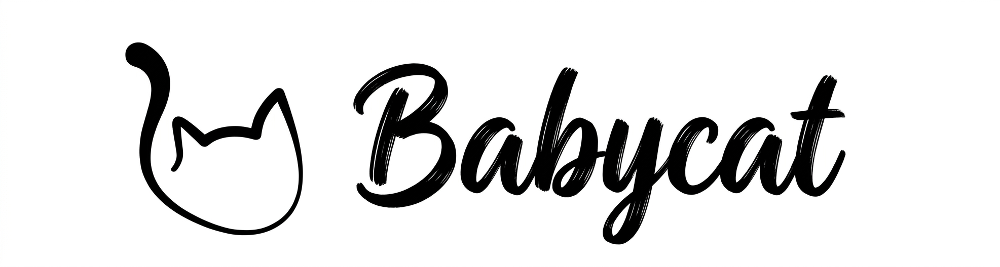

# Babycat

RTSP 카메라 영상을 실시간 VLM(Visual Language Model)으로 분석하고, 사용자가 정의한 조건이 감지되면 알림을 전송하는 엣지 AI 백엔드.

- **엣지 완결형** — NVIDIA Jetson 단독 처리, 외부 클라우드 추론 서버 없음
- **범용 감지** — 감지 조건을 브라우저 UI에서 자연어로 정의 (VLM 프롬프트 + 트리거 키워드)
- **제로 하드코딩** — 카메라 자격증명은 프론트엔드에서 입력, 파일로 영속화

---

## 아키텍처

```
IP Camera (RTSP)
    │
    ▼
┌─────────────────────────────────────────────────┐
│  Jetson Orin NX 16GB                            │
│                                                 │
│  ┌─────────────┐    ┌────────────────────────┐  │
│  │  MediaMTX   │◄───│  App (GStreamer+VLM)   │  │
│  │  :8554 RTSP │    │  :8080 API             │  │
│  │  :8888 HLS  │    │                        │  │
│  │  :9997 API  │    │  GStreamer → GPU Decode │  │
│  │             │    │  → Ring Buffer → VLM   │  │
│  │  세그먼트 녹화 │    │  → 이벤트 판정 → FCM   │  │
│  └─────────────┘    └────────────────────────┘  │
│                              │                  │
│                     ┌────────┴───────┐          │
│                     │  API Server   │          │
│                     │  :8000 REST   │          │
│                     │  SQLite       │          │
│                     └───────────────┘          │
└─────────────────────────────────────────────────┘
```

| 컨테이너 | 포트 | 역할 |
|---|---|---|
| **App** | 8080 | GStreamer 파이프라인, VLM 추론, 이벤트 판정, FCM 발송, PTZ 제어 |
| **MediaMTX** | 8554/8888/9997 | RTSP/HLS 스트리밍, 세그먼트 녹화, REST API로 소스 동적 설정 |
| **API Server** | 8000 | 클립/이벤트/기기토큰 REST API (FastAPI + SQLite) |

---

## 요구사항

| 구성 요소 | 사양 |
|---|---|
| Edge AI 보드 | NVIDIA Jetson Orin NX 16GB (JetPack 6.2) |
| 카메라 | RTSP H.264 IP 카메라 (ONVIF PTZ 옵션) |
| 소프트웨어 | Docker, NVIDIA Container Runtime |

---

## 실행

```bash
# 메인 스택 실행
docker compose up -d

# 디버그 웹 대시보드 (선택)
cd debugging && docker compose up -d
```

최초 실행 시 카메라 설정이 필요합니다. 디버그 웹 UI(`http://<host>:5173`)의 Camera 패널에서 카메라 IP, 포트, 자격증명을 입력하면 MediaMTX와 PTZ 모듈에 자동 적용됩니다. 설정은 파일로 저장되어 재시작 시 자동 로드됩니다.

---

## 디렉토리 구조

```
babycat/
├── app/                   # App 컨테이너 소스
│   ├── main.py            # 엔트리포인트 (GStreamer + VLM + FCM)
│   ├── camera.py          # 카메라 설정 관리 (영속화 + MediaMTX API)
│   ├── server.py          # HTTP 서버 (SSE, MJPEG, PTZ, Camera)
│   ├── state.py           # 공유 상태
│   ├── ptz.py             # ONVIF PTZ 제어
│   └── hardware.py        # Jetson HW 모니터
├── api/                   # API Server 소스
│   ├── main.py            # FastAPI 엔드포인트
│   ├── database.py        # SQLite (WAL)
│   └── schemas.py         # Pydantic 스키마
├── debugging/             # 디버그 웹 UI (Vue 3 + Vite)
│   ├── docker-compose.yml # 독립 실행 (cd debugging && docker compose up -d)
│   └── src/               # Vue SFC + Composables
├── config/                # mediamtx.yml
├── docker/                # Dockerfiles
├── tests/                 # 테스트
├── docs/                  # API 레퍼런스
├── tmp/                   # 개발일지 (devlog.md)
└── docker-compose.yml     # 메인 스택
```

---

## 기술 스택

| 영역 | 기술 |
|---|---|
| VLM 추론 | NanoLLM + VILA1.5-3b (MLC, INT4 양자화) |
| 영상 파이프라인 | GStreamer + nvv4l2decoder (GPU HW 디코딩) |
| 스트리밍 | MediaMTX (RTSP/HLS/WebRTC) |
| 알림 | FCM HTTP v1 API (OAuth 2.0) |
| API 서버 | FastAPI + SQLite (WAL) |
| 디버그 UI | Vue 3 + Vite |
| PTZ 제어 | ONVIF SOAP (WS-Security) |

---

## API 개요

### App (:8080)

| 메서드 | 경로 | 설명 |
|---|---|---|
| GET | `/events` | SSE (추론 결과 + HW 상태 실시간) |
| GET | `/stream` | MJPEG 스트림 (VLM 입력 프레임) |
| GET | `/camera` | 카메라 설정 조회 |
| POST | `/camera` | 카메라 설정 적용 |
| POST | `/prompt` | VLM 프롬프트/트리거 변경 |
| POST | `/ptz` | PTZ 제어 |
| GET | `/clips` | 클립 목록 |
| GET | `/clip/{name}` | 클립 다운로드 (Range 지원) |
| DELETE | `/clips` | 클립 삭제 |

### API Server (:8000)

| 메서드 | 경로 | 설명 |
|---|---|---|
| GET | `/health` | 헬스체크 |
| GET/DELETE | `/clips` | 클립 목록/삭제 |
| GET/POST/DELETE | `/events` | 이벤트 이력 CRUD |
| GET/POST/DELETE | `/devices` | FCM 기기 토큰 관리 |

상세 스키마: [docs/api.md](docs/api.md)

---

## 환경 변수

### App

| 변수 | 기본값 | 설명 |
|---|---|---|
| `MEDIAMTX_URL` | `rtsp://babycat-mediamtx:8554/live` | MediaMTX RTSP 주소 |
| `VLM_MODEL` | `Efficient-Large-Model/VILA1.5-3b` | VLM 모델 ID |
| `TARGET_FPS` | `1.0` | 프레임 샘플링 FPS |
| `N_FRAMES` | `4` | 추론당 프레임 수 |
| `CONSEC_N` | `3` | 연속 감지 조건 (N회) |
| `FCM_CREDENTIALS` | — | FCM 서비스 계정 JSON 경로 |
| `FCM_TOKEN` | — | 수신 기기 FCM 토큰 |

### API Server

| 변수 | 기본값 | 설명 |
|---|---|---|
| `CLIP_DIR` | `/data/clips` | 클립 저장 경로 |
| `DB_PATH` | `/data/db/babycat.db` | SQLite DB 경로 |

---

## 라이선스

Private
