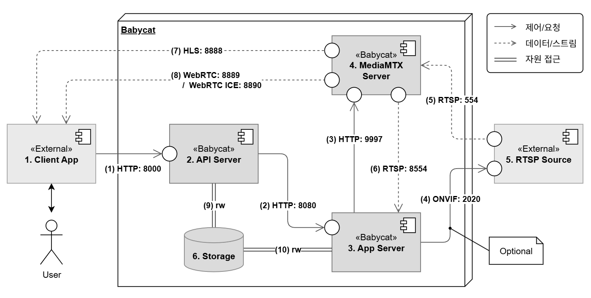

# 세부 설계 정의

## 1. 전체 시스템 구성

사용자의 모든 제어 및 기능 요청은 ***Client App***을 통해 단일 진입점인 ***API Server***를 거쳐 시스템으로 전달된다. 단, HLS/WebRTC 실시간 스트림은 트래픽 분리 및 효율성을 위해 ***MediaMTX Server***가 직접 ***Client App***로 송출한다. 

### 1.1 외부 시스템/요소

전체 시스템 구성도에서 Babycat 외부의 두 요소; ***Client App***과 ***RTSP Source***를 컴포넌트 박스로 표현하고 있으나, 엄밀히 이들은 외부 컴포넌트가 아닌, 외부 시스템 또는 외부 요소라고 표현하는 것이 더 정확하다. 그러나 UML 컴포넌트 다이어그램은 외부 의존 대상도 «External» 스테레오타입을 붙인 컴포넌트 박스로 그리는 관행이 있으므로, 편의상 컴포넌트 박스로 표현되었음을 미리 언급한다.

- ***Client App***
  - 사용자용 프론트엔드 앱

- ***RTSP Source***
  - H.264 기반 RTSP 스트림을 ***MediaMTX Server***에 제공하는 외부 영상 소스
  - ONVIF를 지원할 경우 ***App Server***에서 PTZ 제어 가능

### 1.2 내부 컴포넌트

- ***API Server***
  - `Babycat`의 단일 외부 진입점
  - ***Client App*** 인증(JWT), 계정·이벤트·클립 조회와 같은 요청은 직접 처리
  - ***RTSP Source*** 프로필 설정 등 일부 요청은 ***App Server***로 프록시
  - ***Storage***의 이벤트·사용자 DB에 읽기·쓰기 가능 (rw)
  - ***Storage***의 클립 파일을 조회·삭제 가능

- ***App Server***
  - `Babycat`의 핵심 컴포넌트
  - ***MediaMTX Server***의 스트림을 수신해 VLM 추론과 이벤트 감지를 수행
  - ***RTSP Source*** 프로필 설정 및 PTZ 제어
  - 이벤트 감지 시 해당 시점을 비디오 클립으로 ***Storage***에 쓰기 가능
  - 실시간 모니터링 피드(MJPEG·SSE) 제공

- ***MediaMTX Server***
  - `Babycat`의 미디어 서버
  - ***RTSP Source***의 H.264 기반 RTSP 스트림을 ***Client App***과 ***App Server***에 재배포

- ***Storage***
  - `Babycat`의 영속 데이터 저장소 (`./data` 바인드 마운트 + SQLite)
  - 클립·메타데이터·이벤트 DB 그리고 ***RTSP Source*** 프로필을 영속화
  - ***API Server***와 ***App Server***가 공유
  - 스스로 통신을 개시하지 않고 읽기·쓰기 요청에 응답만 가능

### 1.3 컴포넌트 간 연결
컴포넌트 간 연결은 프로토콜·포트와 방향을 아래와 같이 정의한다. 간선은 도식의 범례에 따라 세 종류로 구분되며, 종류마다 화살표가 가리키는 의미가 다르다.

- **제어/요청** (실선): 한 컴포넌트가 다른 컴포넌트를 호출하는 동기적 요청·응답. 화살표는 요청을 *개시*하는 방향을 가리킨다.
- **데이터/스트림** (점선): 연속적인 미디어가 한 방향으로 흐르는 경로. 화살표는 *데이터 흐름* 방향을 가리킨다(개시 방향과 반대일 수 있다).
- **자원 접근** (이중선): 능동 컴포넌트가 수동 자원(Storage)을 읽고 쓰는 접근. 방향 없이 `rw`로 표기한다.

외부에 공개되는 포트는 (1) 8000과 라이브 스트리밍 (7)·(8)이며, (2)·(3)·(6)·(9)·(10)은 Docker 내부 전용, (4)·(5)는 카메라와의 LAN 구간이다.

|태그|프로토콜|포트|설명|
|---|---|---|---|
|(1)|HTTP|8000|Client App → API Server. 외부 공개. 요청·응답 본문은 JSON. 모든 클라이언트 요청의 단일 진입점(인증·계정·RTSP Source·클립·이벤트).|
|(2)|HTTP|8080|API Server → App Server. Docker 내부 전용. 본문은 JSON. API가 일부 계약(RTSP Source 설정 등)을 App Server로 프록시한다.|
|(3)|HTTP|9997|App Server → MediaMTX Server. 내부 전용. 제어 API v3로 MediaMTX 소스를 설정한다.|
|(4)|ONVIF(HTTP/SOAP)|RTSP Source ONVIF 포트(예: 2020)|App Server → RTSP Source. 조건부(ONVIF 지원 소스에 한함). PTZ 제어.|
|(5)|RTSP(H.264)|RTSP Source 포트(기본 554)|RTSP Source → MediaMTX Server. MediaMTX가 RTSP Source의 URL로 접속해 스트림을 수신한다(연결 개시는 MediaMTX→Source). LAN 구간.|
|(6)|RTSP(H.264)|8554|MediaMTX Server → App Server. 내부 전용. App이 추론용 스트림을 수신한다.|
|(7)|HLS|8888|MediaMTX Server → Client App. 외부 공개. 라이브 영상 재배포.|
|(8)|WebRTC|8889 + 8890/UDP|MediaMTX Server → Client App. 외부 공개. 라이브 영상 재배포(ICE는 8890/UDP).|
|(9)|파일시스템 / SQLite|—|API Server ↔ Storage. 자원 접근(rw). 이벤트·사용자 DB(`/data/db/babycat.db`) 및 클립 파일.|
|(10)|파일시스템|—|App Server ↔ Storage. 자원 접근(rw). RTSP Source 프로필(`/data/config/cam_profile.json`), 클립·롤오버 세그먼트.|

## 2. 세부 기능

각 기능의 경로는 「1. 전체 시스템 구성」의 컴포넌트 태그(1~6)와 연결 태그((1)~(10))로 표기한다. 하나의 처리에서 갈래가 둘 이상이면 `;`로 구분한다. 별도 표기가 없으면 클라이언트(1)가 개시하는 요청이며, `(시스템)`은 클라이언트 개입 없이 내부에서 일어나는 동작이다.

### 2.1 계정 관련 기능

계정 관련 기능은 사용자의 인증 자격을 관리하는 기능이다. 아래는 계정 관련 세부 기능을 나열한 표이다.

|태그|설명|경로|
|---|---|---|
|1-1|로그인 할 수 있다|1→(1)→2|
|1-2|로그아웃 할 수 있다|1→(1)→2|
|1-3|로그인 상태를 유지할 수 있다|1→(1)→2|
|1-4|로그인 비밀번호를 변경할 수 있다|1→(1)→2|

모든 계정 관련 기능은 두 컴포넌트 1과 2만으로 처리되며, HTTP 프로토콜과 포트번호 8000을 사용한다. 여기서 중요한 것은 인증 토큰의 발급과 사용 흐름이다. 1은 1-1(로그인)을 통해 2로부터 Access Token을 획득한다. 만약 1이 체크박스 형태로 `로그인 유지` 옵션을 제공하고 사용자가 이를 선택하면, Access Token과 함께 Refresh Token도 획득할 수 있다.

Access Token은 계정 관련 기능 뿐만 아니라 다른 요청에도 사용된다. 이것은 요청과 함께 서버에 전달되며, 서버는 토큰의 서명과 만료를 검증하여 이를 정당한 요청이라고 판단하면 서비스를 제공한다. 현재 Access Token은 유효 기간이 10분이며, 수명이 다하면 해당 토큰을 사용한 요청은 거부된다.

Refresh Token은 Access Token의 수명이 다하면 자동으로 새로운 Access Token을 획득하는 데 사용된다(1-3). 이를 통해 사용자는 재로그인 과정 없이 로그인 상태를 유지할 수 있다. Refresh Token은 1-3(로그인 상태 유지) 요청으로 새 Access Token을 발급받을 때, 그와 함께 새로 발급되고 기존 토큰은 폐기된다(회전). 기본 유효 기간은 30일이다.

### 2.2 RTSP Source 프로필 관리 기능

RTSP Source는 RTSP를 이용해 비디오 스트림을 송출하는 외부 소스이며, MediaMTX 등의 미디어 서버가 이 스트림을 수신한다. 접속 정보는 URI로 표현되는데, 사용자 계정(ID·PW), 호스트(IP), 포트(Port), 스트림 경로(Path)로 구성되어 `rtsp://ID:PW@IP:Port/Path` 형태를 띤다. 일반적으로 RTSP 포트는 554를 사용하고, 스트림 경로는 소스마다 다르나 흔히 /live, /stream 등을 사용한다. 프로필이란 이처럼 RTSP Source에 접속·제어하기 위한 정보(IP, 계정, RTSP 포트, 스트림 경로, ONVIF 포트 등)의 집합이고, 이 기능은 그 프로필을 등록·조회·수정·적용하는 기능이다.

|태그|설명|경로|
|---|---|---|
|2-1|프로필을 등록할 수 있다|1→(1)→2→(2)→3→(10)→6|
|2-2|프로필을 조회할 수 있다|1→(1)→2→(2)→3→(10)→6|
|2-3|프로필을 수정할 수 있다|1→(1)→2→(2)→3→(10)→6|
|2-4|프로필을 적용/갱신할 수 있다|1→(1)→2→(2)→3→(3)→4|

프로필 등록·수정(2-1·2-3)은 App Server가 Storage에 프로필을 저장하는 것까지만 수행한다((10)). 저장된 프로필을 MediaMTX 소스로 반영하는 적용(활성화)은 부작용 없는 분리 원칙에 따라 등록·수정에 묶지 않고, 사용자가 명시적으로 일으키는 별도 기능 2-4로 둔다. 2-4는 App Server가 제어 API v3로 MediaMTX 소스를 갱신하는 동작이며((3)), 이때 비로소 RTSP Source 스트림이 활성화된다.

### 2.3 RTSP Source 제어 기능 (Optional)

ONVIF를 지원하는 RTSP Source에 한한다. App Server가 ONVIF로 RTSP Source에 직접 명령한다((4)).

|태그|설명|경로|
|---|---|---|
|3-1|RTSP Source를 상하좌우로 움직일 수 있다(PTZ)|1→(1)→2→(2)→3→(4)→5|
|3-2|RTSP Source 이동을 멈출 수 있다|1→(1)→2→(2)→3→(4)→5|
|3-3|현재 위치를 홈으로 저장할 수 있다|1→(1)→2→(2)→3→(4)→5|
|3-4|저장한 홈 위치로 되돌아갈 수 있다|1→(1)→2→(2)→3→(4)→5|

### 2.4 라이브 스트리밍 기능

|태그|설명|경로|
|---|---|---|
|4-1|RTSP Source의 라이브 영상을 실시간으로 볼 수 있다|5→(5)→4→(7)/(8)→1|

영상 데이터는 RTSP Source에서 MediaMTX를 거쳐((5)) 클라이언트에 HLS((7)) 또는 WebRTC((8))로 직접 전달된다. 클라이언트는 둘 중 하나를 사용한다. 소스는 2.2에서 설정된 것을 사용하며, 스트리밍 인증 방식은 미결(D-B)이다.

### 2.5 이벤트 감지 기능

|태그|설명|경로|
|---|---|---|
|5-1|장면 분석에 사용할 VLM 프롬프트를 설정할 수 있다|1→(1)→2→(2)→3|
|5-2|이벤트로 볼 키워드를 설정할 수 있다|1→(1)→2→(2)→3|
|5-3|사용할 VLM 모델을 선택할 수 있다|1→(1)→2→(2)→3|
|5-4|(시스템) 설정된 키워드로 이벤트를 자동 감지하고 클립을 저장한다|5→(5)→4→(6)→3→(10)→6|

5-1과 5-2는 App Server의 동일한 처리에서 함께 설정된다. 5-4는 App Server가 MediaMTX에서 스트림을 받아((6), 8554) VLM 추론·키워드 매칭을 수행하고, 감지 시 클립을 Storage에 저장한다((10)).

### 2.6 비디오 클립 관리 기능

클립 파일과 이벤트 이력은 API Server가 Storage에서 직접 처리한다((9)).

|태그|설명|경로|
|---|---|---|
|6-1|저장된 클립을 조건(키워드·날짜)으로 조회할 수 있다|1→(1)→2→(9)→6|
|6-2|클립을 재생할 수 있다|1→(1)→2→(9)→6|
|6-3|클립을 선택 또는 전체 삭제할 수 있다|1→(1)→2→(9)→6|
|6-4|이벤트 발생 이력을 조회할 수 있다|1→(1)→2→(9)→6|
|6-5|이벤트 발생 이력을 삭제할 수 있다|1→(1)→2→(9)→6|

### 2.7 시스템 실시간 모니터링 기능

App Server가 생성하는 실시간 피드이다.

|태그|설명|경로|
|---|---|---|
|7-1|VLM에 입력되는 영상을 실시간으로 확인할 수 있다|1→(1)→2→(2)→3|
|7-2|분석 상태와 하드웨어 상태(온도·메모리 등)를 실시간으로 확인할 수 있다|1→(1)→2→(2)→3|

7-1은 MJPEG 스트림, 7-2는 상태 스냅샷(SSE)으로 App Server가 제공한다.