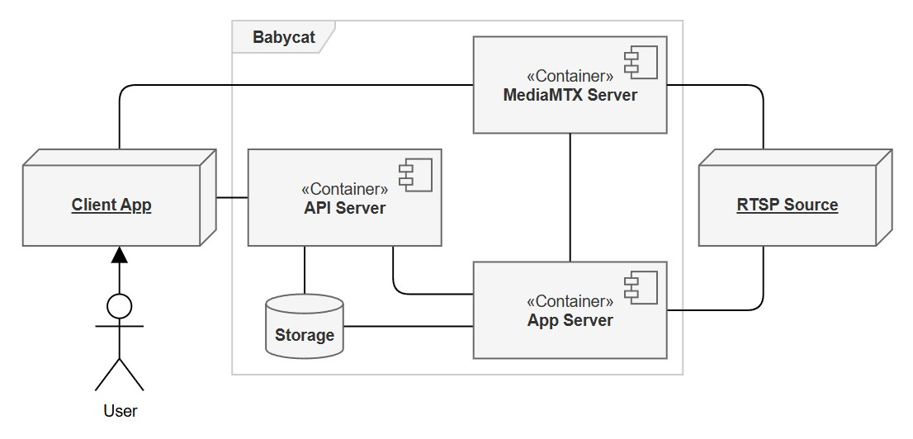

# 1. Introduction; 개요

## 1.1 Purpose; 목적

- SRS를 바탕으로 설계 및 구현 방식을 자세히 기술한다.
- 설계 및 구현의 근거를 기술하는 데 중점을 둔다.

## 1.2 Design Scope; 설계 범위

<figure align="center">
  <picture>
    <source media="(prefers-color-scheme: dark)" srcset="figs/1-1-dark.jpg">
    <source media="(prefers-color-scheme: light)" srcset="figs/1-1-light.jpg">
    
  </picture>
  <figcaption><em>그림 1-1. 전체 시스템 구성</em></figcaption>
</figure>

|구분|이름|설명|
|---|---|---|
|외부 시스템/요소|***Client App***|사용자용 프론트엔드 앱|
|외부 시스템/요소|***RTSP Source***|라이브 비디오를 제공하는 외부 소스|
|내부 컴포넌트|***API Server***|요청 직접 처리 또는 프록시|
|내부 컴포넌트|***App Server***|VLM 추론, 이벤트 감지 및 기록, 실시간 모니터링 피드 등|
|내부 컴포넌트|***MediaMTX Server***|외부 소스의 라이브 비디오 자원을 적절히 분배|
|내부 자원|***Storage***|설정 파일이나 비디오 클립, 데이터베이스 등 제공|

## 1.3 Document Conventions; 문서 규칙

|표기|유형|설명|
|---|---|---|
|`***이름***`|구성 요소|외부 시스템/요소·내부 컴포넌트·자원의 이름 강조 (예: `***API Server***`)|
|`그림 N-M`|그림|도식 번호. N은 장, M은 순번 (예: `그림 1-1`)|
|`D-`|설계 결정|§6에 기록되는 설계 결정 (예: `D-A`)|
|`F-`|조사 기록|결정에 앞서 확인된 사실, Finding (예: `F-1`)|

## 1.4 Terms and Abbreviations; 정의 및 약어

|용어|정의|
|---|---|
|-|-|

## 1.5 Related Documents; 관련 문서

작성 보류

## 1.6 Intended Audience and Reading Suggestions; 대상 및 읽는 방법

작성 보류