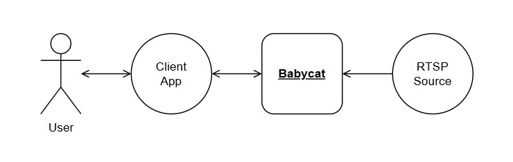
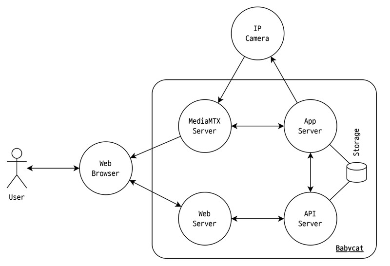

# 2. Overall Description; 전체 설명

## 2.1 Product Perspective; 제품 조망

Babycat은 Jetson Board에서 동작하는 독립 실행형 백엔드로서 RTSP Source로부터 비디오 스트림을 수신하여 VLM으로 분석하고 Client App의 요청에 맞는 서비스를 제공한다.

|항목|설명|
|---|---|
|Client App|Babycat API를 통해 시스템과 상호작용하는 외부 클라이언트 앱.|
|RTSP Source|RTSP를 통해 비디오 스트림을 Babycat에 송신하는 외부 소스.|

## 2.2 Overall System Configuration; 전체 시스템 구성

Babycat은 네 가지 내부 컴포넌트로 구성된다. 다이어그램에는 외부 요소인 Client App과 RTSP Source도 함께 표시되며, 이들은 본 프로젝트(백엔드)의 개발 범위 밖이다.

Storage 옆의 레이블(rw)은 해당 컴포넌트의 접근 권한을 나타낸다. 화살표 규약은 1.3을 따른다.

|항목|설명|
|---|---|
|Client App|User가 Babycat을 이용하기 위한 클라이언트 앱(Android·iOS·Web 등). API Server와 통신하여 User에게 서비스를 제공.|
|MediaMTX Server|RTSP Source로부터 비디오 스트림을 수신하고, App Server 및 Client App에 재배포하는 미디어 서버.|
|API Server|Client App의 HTTP 요청을 처리하는 단일 진입점 서버. App Server와 연동하여 기능을 수행한다.|
|App Server|VLM 추론, 이벤트 감지, 비디오 클립 저장 등 핵심 기능을 담당하는 서버. ONVIF를 지원하는 RTSP Source에 한해 PTZ 제어를 수행한다.|
|Storage|시스템 운영에 필요한 데이터의 영속 저장소. 비디오 클립, 메타데이터, 카메라 프로필 등을 포함한다.|
|RTSP Source|RTSP로 H.264 비디오 스트림을 제공하는 외부 영상 소스(IP 카메라 등).|

## 2.3 Overall Operation; 전체 동작 방식

### A. 카메라 프로필 관리

1. **User**가 **Client App**에서 카메라 프로필을 작성한 후 저장을 요청한다.
2. **Client App**은 작성된 내용을 **API Server**에 전송한다.
3. **API Server**는 수신한 내용을 **App Server**에 전달한다.
4. **App Server**는 수신한 내용을 **Storage**에 저장한다.

### B. 카메라 제어

본 시나리오는 카메라 프로필이 저장되어 있고, **RTSP Source**가 ONVIF PTZ를 지원하는 경우에 한한다.

1. **User**가 **Client App**에서 PTZ 방향 버튼을 누른다.
2. **Client App**은 이동 명령을 **API Server**에 전송한다.
3. **API Server**는 이동 명령을 **App Server**에 전달한다.
4. **App Server**는 ONVIF를 통해 **RTSP Source**에 이동 명령을 전달한다.
5. **User**가 버튼에서 손을 떼면 **Client App**은 정지 명령을 **API Server**에 전송한다.
6. **API Server**는 정지 명령을 **App Server**에 전달한다.
7. **App Server**는 ONVIF를 통해 **RTSP Source**에 정지 명령을 전달한다.

### C. 라이브 스트리밍

본 시나리오는 카메라 프로필이 저장되어 있는 경우에 한한다.

1. **User**가 **Client App**에서 라이브 스트리밍 재생을 요청한다.
2. **Client App**은 **API Server**에 스트림 접속 정보를 요청한다.
3. **API Server**는 **MediaMTX Server**의 스트림 접속 정보(스트림 URL과 JWT)를 **Client App**에 반환한다.
4. **Client App**은 JWT를 사용하여 **MediaMTX Server**에 직접 연결한다.
5. **MediaMTX Server**는 JWT 검증에 성공한 경우에만 HLS 또는 WebRTC 스트림을 송신한다.

### D. 비디오 분석 및 이벤트 클립 저장

본 시나리오는 카메라 프로필이 저장되어 있고, 이벤트 키워드가 설정되어 있는 경우에 한한다.

1. **App Server**는 저장된 카메라 프로필의 소스를 **MediaMTX Server**에 전달하고 파이프라인을 재시작한다.
2. **MediaMTX Server**는 RTSP를 통해 **RTSP Source**로부터 비디오 스트림을 수신하여 **App Server**에 송신한다.
3. **App Server**는 수신한 비디오 스트림에서 주기적으로 프레임을 추출한다.
4. **App Server**는 추출한 프레임을 VLM에 입력하여 장면 설명을 얻는다.
5. **App Server**는 VLM 응답에 사용자가 설정한 이벤트 키워드가 포함되어 있는지 확인한다.
6. 포함되어 있다면 **App Server**는 해당 시점의 비디오 클립을 **Storage**에 저장한다.

### E. 클립 재생

1. **User**가 **Client App**에서 특정 클립의 재생 버튼을 누른다.
2. **Client App**은 **API Server**에 해당 클립을 요청한다.
3. **API Server**는 **Storage**에서 해당 클립 파일을 읽어온 후 **Client App**에 스트리밍한다.
4. **Client App**은 수신한 스트림을 화면에 표시한다.

### F. 클립 조회 및 삭제

1. **User**가 **Client App**에서 클립 목록 조회 또는 삭제 버튼을 누른다.
2. **Client App**은 **API Server**에 클립 목록 조회 또는 삭제를 요청한다.
3. **API Server**는 **Storage**에서 클립 목록을 조회하거나 삭제하고 결과를 **Client App**에 반환한다.
4. **Client App**은 요청 결과를 화면에 표시한다.

## 2.4 Product Functions; 제품 주요 기능

요구자(운영자) 관점에서 본 제품의 주요 기능을 정리한다. 각 기능의 상세 요구사항은 Section 7(기능 요구사항)에, 실현 방식(설계·알고리즘)은 별도 설계 문서(SDD)에 기술한다. 관례에 따라 본 절과 2.3은 대표 수준으로 유지한다.

**계정**
- 로그인·로그아웃하고, 로그인 상태를 유지(자동 갱신)하며, 비밀번호를 변경할 수 있다.

**카메라 설정**
- 카메라(RTSP Source) 프로필을 등록·조회·수정할 수 있다.

**카메라 제어** (ONVIF를 지원하는 카메라에 한함)
- 카메라를 상하좌우로 움직이고(PTZ), 현재 위치를 홈으로 저장하여 그 위치로 되돌아갈 수 있다.

**라이브 영상**
- 카메라의 라이브 영상을 실시간으로 볼 수 있다.

**이벤트 감지 설정 (VLM 튜닝)**
- 장면 분석에 사용할 VLM 프롬프트를 정할 수 있다.
- 어떤 장면을 이벤트로 볼지 키워드를 정할 수 있다.
- 사용할 VLM 모델을 고를 수 있다.

**이벤트와 클립**
- 설정한 이벤트가 감지되면, 시스템이 그 순간의 영상을 클립으로 자동 저장한다.
- 저장된 클립을 조건(키워드·날짜)으로 조회하고, 재생하고, 삭제(선택 또는 전체)할 수 있다.
- 이벤트 발생 이력을 조회하고 삭제할 수 있다.

**실시간 모니터링**
- VLM에 입력되는 영상을 실시간으로 확인할 수 있다.
- 분석 상태와 하드웨어 상태(온도·메모리 등)를 실시간으로 확인할 수 있다.

이벤트 푸시 알림은 차기 버전으로 미룬다(2.7 참조).

## 2.5 User Classes and Characteristics; 사용자 계층과 특징

### 운영자(Operator)
- 카메라가 설치된 현장을 관리하며 Client App을 통해 Babycat과 상호작용하는 주 사용자이다.
- 카메라 프로필 및 이벤트 키워드 설정, 카메라 PTZ 제어, 라이브 스트림 모니터링, 이벤트 클립 조회·재생·삭제를 주로 수행한다.
- VLM이나 AI에 대한 전문 지식 없이도 기본 기능을 사용할 수 있어야 한다.

### 시스템 관리자(System Administrator)
- Jetson Board에 Babycat을 배포하고 유지 관리하는 사람이다.
- Docker 및 Linux에 대한 기본 지식이 요구된다.
- 초기 환경 설정(환경 변수, 네트워크, VLM 모델 선택 등)을 담당한다.

## 2.6 Assumptions and Dependencies; 가정과 종속관계

### 가정

- Babycat은 VLM 도입 검토를 위해 설계되었다. 만약 프로덕션용 백엔드로 활용할 계획이라면, 대상 도메인이 VLM으로 장면을 충분히 잘 묘사하며 키워드 매칭 방식으로 이벤트를 감지하기에 적합하여야 한다. 이 가정이 성립하지 않으면 활용이 어려울 수 있다.
- Babycat은 원활한 시스템 구동과 VLM 로드를 위해 메모리 용량이 16GB 이상인 Jetson Board를 사용한다고 가정한다. 만약 이보다 메모리 볼륨이 더 작은 환경이라면 VLM 로드가 실패할 수 있다.
- NanoLLM(dustynv/jetson-containers)은 향후에도 Jetson Platform을 지원하며 프로젝트 호환성이 유지될 것이라고 가정한다. 만약 프로젝트가 중단되거나 호환성이 깨질 경우 VLM 추론 스택 전체를 다른 것으로 교체해야 할 수 있다.

### 종속관계

- Babycat은 하드웨어 비디오 디코더/인코더가 탑재된 Jetson Module(Orin NX 이상 급)에서 동작하도록 설계되었다. 이 하드웨어가 제공되지 않으면 소프트웨어 디코더/인코더를 GStreamer 파이프라인 코드에 직접 추가해야 한다.
- Babycat은 JetPack 6.2를 기준으로 개발되었다. 다른 버전의 JetPack에서는 원활한 구동이 보장되지 않는다.
- RTSP Source는 H.264로 인코딩된 비디오 스트림을 제공해야 한다. 다른 코덱으로 인코딩된 스트림은 아직 지원하지 않는다.

## 2.7 Apportioning of Requirements; 단계별 요구사항

1인 프로젝트이고 출시 일정이 확정되지 않은 특성상, 날짜 기반 버전보다는 기능 단위로 단계를 나누어 작성한다.

### v1.0 (기준 버전)

- API Server를 단일 진입점으로 하는 아키텍처를 구현한다.
- 단일 카메라 프로필을 지원한다.
- H.264 RTSP 소스에 대한 VLM 기반 이벤트 감지 및 클립 저장을 지원한다.
- HLS/WebRTC 라이브 스트리밍을 지원한다.
- 클립 조회, 재생, 삭제를 지원한다.
- ONVIF PTZ 제어(지원 카메라에 한함)를 지원한다.
- JWT 기반 사용자 인증을 지원한다.

### 이후 버전으로 미루는 기능

|기능|아키텍처 영향|
|---|---|
|다중 카메라 지원|단일 카메라를 전제한 파이프라인 구조 및 카메라 프로필 데이터 모델을 전면 재설계해야 한다.|
|H.264 외 코덱(H.265 등) 지원|GStreamer 파이프라인에서 코덱 처리를 추상화해야 한다.|
|이벤트 푸시 알림|외부 푸시 서비스(FCM 등) 연동이 추가되어 2.1의 외부 시스템 구성이 변경된다. API Server에 디바이스 토큰 관리가 필요하다.|

장기 영상 트렌드 분석과 Jetson 외 환경 지원은 이후 버전으로 미루는 기능이 아니라 범위 밖이다. (1.2 참조)

## 2.8 Backward Compatibility; 하위 호환성

이 시스템은 첫 버전이기 때문에 하위 호환성을 고려할 필요가 없다.
