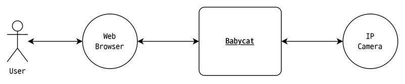

# 2. 전체 설명; Overall Description

## 2.1 프로젝트 조망; Project Perspective

babycat은 단일 엣지 디바이스에서 동작하는 독립 실행형 시스템이다. 외부와의 접점은 두 가지다.

|인터페이스|설명|
|---|---|
|Web Browser|babycat과 상호작용하기 위한 웹 브라우저.|
|IP Camera|babycat에 비디오 스트림을 제공하는 외부 장치. ONVIF 지원 시 PTZ 제어 대상.|

## 2.2 전체 시스템 구성; Overall System Configuration

babycat은 다섯 가지 내부 컴포넌트로 구성된다.

|컴포넌트|설명|
|---|---|
|MediaMTX Server|IP 카메라의 비디오 스트림을 App Server와 Web Browser에 재배포하는 미디어 서버.|
|App Server|VLM 추론, 이벤트 감지, 비디오 클립 저장, PTZ 제어 등 핵심 기능을 제공하는 앱 서버.|
|API Server|비디오 클립 조회/삭제, 카메라 설정 변경 등 HTTP 요청 처리 서버.|
|Web Server|웹 프론트엔드 정적 파일 제공 및 API 요청 중계 서버.|
|Storage|비디오 클립과 메타데이터의 영속 저장소.|

## 2.3 전체 동작; Overall Operation

### 카메라 프로필 저장

1. **User**가 **Web Browser**에서 카메라 프로필을 작성한 후 저장 버튼을 누른다. 
2. **Web Browser**는 작성된 내용을 **Web Server**에 전송한다.
3. **Web Server**는 수신한 내용을 **API Server**에 전달한다.
4. **API Server**는 수신한 내용을 **App Server**에 전달한다.
5. **App Server**는 수신한 내용을 내부에 저장한다.

### 비디오 분석 및 이벤트 클립 저장

1. **App Server**는 저장된 카메라 프로필의 소스를 **MediaMTX Server**에 전달하고 파이프라인을 재시작한다.
2. **MediaMTX Server**는 RTSP를 통해 **IP Camera**로부터 수신한 비디오 스트림을 **App Server**에 송신한다.
3. **App Server**는 수신한 비디오 스트림에서 주기적으로 프레임을 추출한다.
4. **App Server**는 추출한 프레임을 VLM에 입력하여 장면 설명을 얻는다.
5. **App Server**는 VLM 응답에 사용자가 설정한 이벤트 키워드가 포함되어 있는지 확인한다.
6. 포함되어 있다면 **App Server**는 해당 시점의 비디오 클립을 **Storage**에 저장한다.

### 라이브 스트리밍

1. **User**가 **Web Browser**에서 라이브 스트리밍 재생 버튼을 누른다.
2. **Web Browser**는 **MediaMTX Server**에 라이브 스트림을 요청한다.
3. **MediaMTX Server**는 수신 중인 비디오 스트림을 HLS 또는 WebRTC로 **Web Browser**에 송신한다.

### 클립 조회 및 삭제

1. **User**가 **Web Browser**에서 클릭 목록 조회 또는 삭제 버튼을 누른다.
2. **Web Browser**는 **Web Server**에 클립 목록 조회 또는 삭제를 요청한다.
3. **Web Server**는 수신된 요청을 **API Server**에 전달한다.
4. **API Server**는 수신된 요청에 따라 **Storage**에서 클립 목록을 조회하거나 삭제하고, 결과를 반환한다.

## 2.4 주요 기능; Project Functions

## 2.5 사용자 분류 및 특성; User Classes and Characteristics

## 2.6 가정 및 의존성; Assumptions and Dependencies

## 2.7 요구사항 배분; Apportioning of Requirements

## 2.8 하위 호환성; Backward Compatibility
