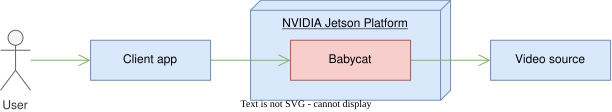
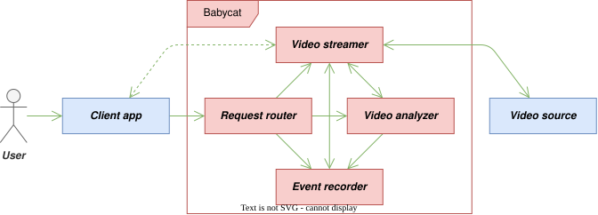
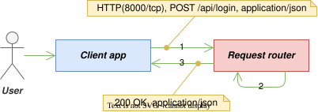
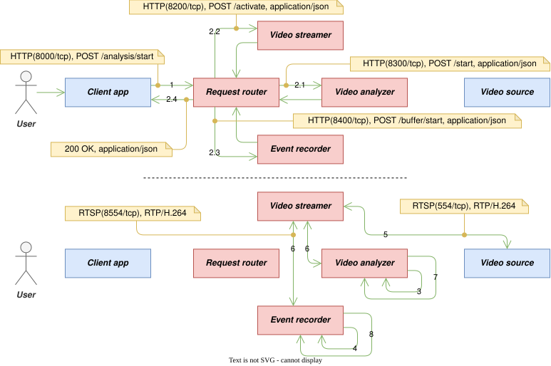
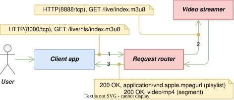
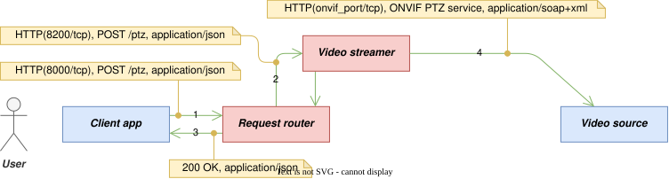
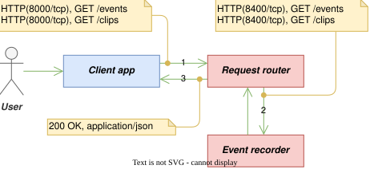
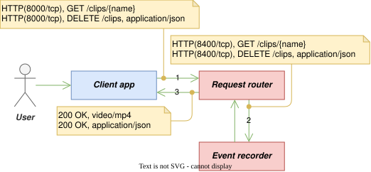

# 2. 전체 설명 (Overall Description)

## 2.1 제품 조망 (Product Perspective)

NVIDIA Jetson Platform은 좁게는 `Babycat`이 구동되는 하드웨어 자체를, 넓게는 하드웨어와 소프트웨어를 포함한 에코시스템 전체를 뜻한다. 아래 조망도는 `Babycat`과 NVIDIA Jetson Platform, 그리고 외부 시스템인 ***Client app***과 ***Video source***의 관계를 나타낸다. NVIDIA Jetson Platform은 `Babycat`의 배경 인프라이므로, 이 조망도 이후의 다이어그램에서는 표기를 생략한다.

<figure align="center">
  
  <figcaption><em>그림 2-1. 제품 조망도</em></figcaption>
</figure>

- ***User*** : ***Client app***을 통해 `Babycat`을 사용하는 사람
- ***Client app*** : `Babycat` 사용자용 프론트엔드 앱
- ***Video source*** : `Babycat`에 라이브 비디오를 제공하는 외부 소스 (예: IP 카메라)

## 2.2 전체 시스템 구성 (Overall System Configuration)

<figure align="center">
  
  <figcaption><em>그림 2-2. 전체 시스템 구성도</em></figcaption>
</figure>

- ***Request router*** : 단일 외부 진입점. 계정을 인증·관리하며, 요청의 토큰을 검증하여 라우팅한다.
- ***Video streamer*** : 비디오 소스 프로필을 관리하고 PTZ를 제어하며, ***Video source***의 스트림을 RTSP로 수신하여 내부에 재배포한다.
- ***Video analyzer*** : VLM 추론으로 장면을 분석한다.
- ***Event recorder*** : 이벤트를 기록하고 클립과 이력을 관리하며, 하드웨어 상태를 측정한다.

## 2.3 전체 동작 방식 (Overall Operation)

### (1) 자격증명 및 로그인 유지

<figure align="center">
  
  <figcaption><em>그림 2-3-1. 자격증명 및 로그인 유지</em></figcaption>
</figure>

1. ***User***가 자격증명을 입력하여 로그인을 요청하면, ***Client app***은 이 요청을 ***Request router***에게 전달한다. 로그인 유지를 원하는지도 함께 전달한다.
    - 형태: `HTTP(8000/tcp), POST /api/login, application/json`
    - 자격증명과 로그인 유지 여부는 JSON 본문에 담긴다.
    - 프로토타이핑은 HTTP를 사용하였으나, 프로덕션용은 반드시 HTTPS로 구현하여야 한다.
2. ***Request router***는 전달받은 자격증명을 검증한다.
    - 검증은 내부에 저장된 계정 정보를 이용해 외부 통신 없이 수행한다.
    - 입력된 비밀번호를 내부에 저장된 해시와 대조한다.
3. ***Request router***는 검증 결과를 ***Client app***에게 응답한다.
    - 형태: `200 OK, application/json`
    - 자격증명이 정당하면, 액세스 토큰을 발급하여 응답에 담는다.
    - 자격증명이 정당하고 로그인 유지가 요청되었다면, 리프레시 토큰도 함께 발급한다.
    - 자격증명이 정당하지 않으면 거부한다.
4. ***Client app***은 이후의 모든 요청에 발급받은 액세스 토큰을 함께 보낸다.
    - ***Request router***는 토큰이 없거나 유효하지 않은 요청을 거부한다.

### (2) 비디오 소스 프로필 등록

<figure align="center">
  
  <figcaption><em>그림 2-3-2. 비디오 소스 프로필 등록</em></figcaption>
</figure>

1. ***User***가 ***Video source*** 프로필을 입력하여 등록을 요청하면, ***Client app***은 이 요청을 ***Request router***에게 전달한다.
    - 형태: `HTTP(8000/tcp), POST /camera, application/json`
    - 프로필은 JSON 본문에 담긴다.
2. ***Request router***는 전달받은 요청을 ***Video streamer***에게 중개한다.
    - 형태: `HTTP(8200/tcp), POST /profile, application/json`
3. ***Video streamer***는 프로필을 저장하고, 그 결과를 ***Request router***를 거쳐 ***Client app***에게 응답한다.
    - 형태: `200 OK, application/json`

### (3) 비디오 분석 조건 설정

<figure align="center">
  
  <figcaption><em>그림 2-3-3. 비디오 분석 조건 설정</em></figcaption>
</figure>

1. ***User***가 프롬프트와 이벤트 키워드를 입력하여 설정을 요청하면, ***Client app***은 이 요청을 ***Request router***에게 전달한다.
    - 형태: `HTTP(8000/tcp), POST /prompt, application/json`
    - 프롬프트와 이벤트 키워드는 JSON 본문에 담긴다.
2. ***Request router***는 전달받은 요청을 ***Video analyzer***에게 중개한다.
    - 형태: `HTTP(8300/tcp), POST /prompt, application/json`
3. ***Video analyzer***는 프롬프트와 이벤트 키워드를 저장하고, 그 결과를 ***Request router***를 거쳐 ***Client app***에게 응답한다.
    - 형태: `200 OK, application/json`
    - 설정이 저장되더라도 분석은 자동으로 시작되지 않는다.

### (4) 비디오 분석 시작

<figure align="center">
  
  <figcaption><em>그림 2-3-4. 비디오 분석 시작</em></figcaption>
</figure>

1. ***User***가 분석 시작을 요청하면, ***Client app***은 이 요청을 ***Request router***에게 전달한다.
    - 형태: `HTTP(8000/tcp), POST /analysis/start`
    - 이 요청은 본문이 없다.
2. ***Request router***는 이 요청을 ***Video analyzer***·***Video streamer***·***Event recorder***에게 전달한다.
    1. 형태(→***Video analyzer***): `HTTP(8300/tcp), POST /start, application/json`
    2. 형태(→***Video streamer***): `HTTP(8200/tcp), POST /activate, application/json`
    3. 형태(→***Event recorder***): `HTTP(8400/tcp), POST /buffer/start, application/json`
    4. 셋이 모두 수락하면, ***Request router***는 ***Client app***에게 성공을 응답한다. 형태: `200 OK, application/json`
3. ***Video analyzer***는 장면 분석 파이프라인을 초기화하고, 스트림이 재배포되기를 대기한다.
4. ***Event recorder***는 이벤트 직전 구간을 클립에 담기 위한 비디오 보관을 준비하고, 스트림이 재배포되기를 대기한다.
5. ***Video streamer***는 등록된 프로필에 따라 RTSP로 ***Video source***에 접속하여 스트림을 수신한다.
    - 형태: `RTSP(554/tcp), RTP/H.264`
    - 포트 554는 ***Video source***에 따라 다를 수 있다.
6. ***Video streamer***는 수신한 스트림을 내부에 재배포한다.
    - 형태: `RTSP(8554/tcp), RTP/H.264`
    - ***Video analyzer***와 ***Event recorder***는 각자 재배포 스트림에 접속한다.
7. 대기 중이던 ***Video analyzer***가 장면 분석 파이프라인을 가동한다.
8. 대기 중이던 ***Event recorder***가 최근 구간의 비디오 보관을 시작한다.

### (5) 이벤트 감지와 기록 - 자동 실행

<figure align="center">
  
  <figcaption><em>그림 2-3-5. 이벤트 감지와 기록</em></figcaption>
</figure>

1. ***Video analyzer***는 장면 분석 파이프라인을 통해 생성된 텍스트에 ***User***가 설정한 이벤트 키워드가 포함되어 있는지 검사한다.
2. 키워드가 포함되어 있으면, ***Video analyzer***는 해당 상황을 이벤트 발생으로 판단하여 ***Event recorder***에게 기록을 요청한다.
    - 형태: `HTTP(8400/tcp), POST /notify, application/json`
    - 일치한 키워드, 생성된 텍스트, 판정 시각과 마지막 프레임 시각은 JSON 본문에 담긴다.
3. ***Event recorder***는 응답 후 기록을 준비한다.
    - 형태: `202 Accepted, application/json`
4. ***Event recorder***는 해당 구간의 비디오 클립과 발생 이력을 저장한다.
    - 가용 저장 공간이 임계치 이하로 떨어지면, 가장 오래된 클립과 이력부터 순차적으로 삭제하여 공간을 확보한다.

### (6) 라이브 비디오 재생

#### HLS 기반

<figure align="center">
  
  <figcaption><em>그림 2-3-6-a. 라이브 비디오 재생 - HLS</em></figcaption>
</figure>

1. ***User***가 라이브 비디오 재생을 요청하면, ***Client app***은 이 요청을 ***Request router***에게 전달한다.
    - 형태: `HTTP(8000/tcp), GET /live/hls/index.m3u8`
2. ***Request router***는 전달받은 요청을 ***Video streamer***에게 중개한다.
    - 형태: `HTTP(8888/tcp), GET /live/index.m3u8`
3. ***Video streamer***는 라이브 비디오를 HLS로 전달한다.
    - HLS 비디오는 ***Request router***를 경유하여 ***Client app***에게 전달된다.
    - 형태(재생목록): `200 OK, application/vnd.apple.mpegurl`
    - 형태(세그먼트): `200 OK, video/mp4(segment)`

#### WebRTC 기반

<figure align="center">
  
  <figcaption><em>그림 2-3-6-b. 라이브 비디오 재생 - WebRTC</em></figcaption>
</figure>

1. ***User***가 라이브 비디오 재생을 요청하면, ***Client app***은 이 요청을 ***Request router***에게 전달한다.
    - 형태: `HTTP(8000/tcp), POST /live/whep, application/sdp`
2. ***Request router***는 전달받은 요청을 ***Video streamer***에게 중개한다.
    - 형태: `HTTP(8889/tcp), POST /live/whep, application/sdp`
3. ***Video streamer***는 시그널링에 응답한다.
    - 형태: `201 Created, application/sdp`
4. WebRTC 비디오는 저지연을 위해 ***Request router***를 경유하지 않고 ***Client app***에게 직접 전달된다.
    - 형태: `WebRTC(8189/udp), SRTP/H.264`

### (7) 비디오 소스 PTZ 제어

<figure align="center">
  
  <figcaption><em>그림 2-3-7. 비디오 소스 PTZ 제어</em></figcaption>
</figure>

1. ***User***가 팬·틸트·줌 제어를 요청하면, ***Client app***은 이 요청을 ***Request router***에게 전달한다.
    - 형태: `HTTP(8000/tcp), POST /ptz, application/json`
    - 동작의 종류(이동·정지·홈 저장·홈 복귀)와 이동량은 JSON 본문에 담긴다.
2. ***Request router***는 전달받은 요청을 ***Video streamer***에게 전달한다.
    - 형태: `HTTP(8200/tcp), POST /ptz, application/json`
3. ***Video streamer***는 요청을 수신했음을 ***Request router***를 거쳐 ***Client app***에게 응답한다.
    - 형태: `200 OK, application/json`
    - 이 응답이 ONVIF 제어의 완료를 의미하는 것은 아니다.
4. ***Video streamer***는 ONVIF를 이용하여 ***Video source***를 직접 제어한다.
    - 형태: `HTTP(onvif_port/tcp), ONVIF PTZ 서비스, application/soap+xml`
    - 접속 포트는 프로필에 등록된 `onvif_port`를 따른다.
    - ***Video source***가 ONVIF를 지원하지 않거나 접근을 허용하지 않으면, 요청은 별도의 오류 없이 무시된다.

### (8) 이벤트 클립과 이력 관리

#### 이벤트 클립 및 이력 조회

<figure align="center">
  
  <figcaption><em>그림 2-3-8-a. 이벤트 클립 및 이력 조회</em></figcaption>
</figure>

1. ***User***가 조건(키워드·날짜)으로 조회를 요청하면, ***Client app***은 이 요청을 ***Request router***에게 전달한다.
    - 형태(이력): `HTTP(8000/tcp), GET /events`
    - 형태(클립 목록): `HTTP(8000/tcp), GET /clips`
    - 조회 조건은 쿼리 문자열에 담긴다.
2. ***Request router***는 이 요청을 ***Event recorder***에게 중개한다. ***Event recorder***는 조건에 일치하는 이력을 조회하고, ***Request router***는 그 결과를 ***Client app***에게 전달한다.
    - 형태(이력): `HTTP(8400/tcp), GET /events`
    - 형태(클립 목록): `HTTP(8400/tcp), GET /clips`
    - 형태(응답): `200 OK, application/json`

#### 이벤트 클립 재생·삭제

<figure align="center">
  
  <figcaption><em>그림 2-3-8-b. 이벤트 클립 재생·삭제</em></figcaption>
</figure>

1. ***User***가 특정 클립의 재생이나 삭제를 요청하면, ***Client app***은 이 요청을 ***Request router***에게 전달한다.
    - 형태(재생): `HTTP(8000/tcp), GET /clips/{name}`
    - 형태(삭제): `HTTP(8000/tcp), DELETE /clips, application/json`
    - 삭제할 클립의 이름들은 JSON 본문에 담긴다.
2. ***Request router***는 이 요청을 ***Event recorder***에게 중개한다.
    - 형태(재생): `HTTP(8400/tcp), GET /clips/{name}`
    - 형태(삭제): `HTTP(8400/tcp), DELETE /clips, application/json`
3. ***Event recorder***는 해당 클립을 반환하거나 삭제하고, ***Request router***는 그 결과를 ***Client app***에게 전달한다.
    - 형태(재생 응답): `200 OK, video/mp4`
      - 구간(Range) 요청에는 `206 Partial Content`로 응답한다.
    - 형태(삭제 응답): `200 OK, application/json`

## 2.4 제공 기능 (Functions)

- **사용자 계정 인증 및 관리** — ***Client app***이 `Babycat`에 접근하려면 인증을 거쳐야 한다. 인증된 ***User***는 재로그인 없이 상태를 유지하며 자신의 비밀번호를 변경할 수 있다. 다수 계정이 필요하지 않다고 판단하여 계정의 추가/삭제 기능은 두지 않으며, `admin` 계정 하나만을 대상으로 한다.
- **비디오 소스 프로필 관리** — 프로필은 ***Video source***에 접근하기 위한 정보의 집합으로, IP 주소, 포트, 스트림 경로, 자격증명 등으로 구성된다. ***User***는 프로필을 등록·조회·수정할 수 있다. ***Video source***에는 RTSP 카메라, 비디오 파일, USB 카메라, 미디어 서버 등 여러 유형이 있으나, 가장 대중적인 RTSP 카메라만을 대상으로 한다.
- **비디오 소스 PTZ 제어** — ***User***는 ***Video source***의 팬·틸트·줌을 조작하고, 홈 위치를 저장하여 그리로 되돌릴 수 있다. ***Video source***가 ONVIF를 지원하지 않거나 접근을 허용하지 않으면 요청은 별도의 오류 없이 무시된다.
- **라이브 스트리밍** — ***User***는 ***Video source***의 라이브 비디오를 재생할 수 있다. 비디오는 HLS/WebRTC로 전달되며, 재생 요청 역시 인증을 거쳐야 한다.
- **장면 분석 및 이벤트 기록** — `Babycat`의 핵심 기능군이다. 설정된 VLM과 ***User***가 입력한 프롬프트로 장면을 분석하고, ***User***가 설정한 키워드에 해당하는 상황을 이벤트로 감지하여 그 구간의 비디오 클립과 발생 이력을 자동으로 저장한다.
- **이벤트 발생 이력 관리** — ***User***는 저장된 이벤트 발생 이력을 조건(키워드·날짜)으로 조회하고 삭제할 수 있다.
- **비디오 클립 관리** — ***User***는 저장된 비디오 클립을 조건(키워드·날짜)으로 조회·재생·삭제할 수 있다.
- **시스템 실시간 모니터링** — ***User***는 VLM 분석 과정과 하드웨어 상태(온도, 메모리 등)를 실시간으로 확인할 수 있다.

## 2.5 사용자 계층과 특징 (User Classes and Characteristics)

- 연구자
  - VLM이 자기 분야의 장면을 알아볼 수 있는지 시험해 보려는 사람이다.
  - 프롬프트와 이벤트 키워드를 바꿔가며 감지 결과가 어떻게 달라지는지 비교한다.
  - 쌓인 클립과 발생 이력을 훑어 VLM의 판정이 쓸 만한지 가늠한다.
- 개발자
  - 자신의 감시 서비스 및 앱을 만들려는 사람이다.
  - HTTP API와 라이브 스트림을 가져다 자신의 ***Client app***을 붙인다.
  - Jetson Board와 Docker를 다룰 줄 안다.
- 현장 관리자
  - 영상을 외부로 내보낼 수 없는 현장에서 카메라를 지켜봐야 하는 사람이다.
  - 감시할 상황을 키워드로 걸어두고, 이벤트가 잡히면 그 구간의 클립만 확인한다.
  - 화면을 종일 지켜보지 않는다.

## 2.6 가정과 종속 관계 (Assumptions and Dependencies)

- 키워드 매칭 방식을 이용해 목적 이벤트를 유의미한 수준으로 감지할 수 있다고 가정한다.
- 개인영상정보 관련 법규가 구동을 제한하지 않는다고 가정한다.
- LAN, VPN 등 신뢰할 수 있는 내부 네트워크 안에서만 구동된다고 가정한다.
- NanoLLM 베이스 이미지를 지속적으로 보존하고 배포할 수 있다고 가정한다.
- ***Video source***는 H.264로 인코딩된 비디오 스트림을 RTSP로 제공할 수 있다고 가정한다.
- 하드웨어 비디오 디코더/인코더를 갖추고 메모리가 16GB 이상인 Jetson Module을 사용한다고 가정한다.
- JetPack 6.2.1, Docker 29.1.3, NVIDIA Container Toolkit 1.16.2와 호환되는 환경을 갖춰야 한다.
- PTZ 제어 기능은 ***Video source***가 ONVIF를 지원해야만 사용할 수 있다.

## 2.7 단계별 요구사항 (Apportioning of Requirements)

소규모 프로젝트 특성상, 날짜가 아닌 기능 단위로 단계를 나눈다. ***Request router***를 단일 진입점으로 하여 제공 기능의 여덟 기능군을 모두 구현한다(v1.0). 단, ***Video source***는 H.264 RTSP 카메라 한 대로 한정한다. 첫 버전 출시 후, 차기 버전에서 아래 기능을 구현한다.

- 다중 카메라 지원 : 단일 카메라를 전제한 파이프라인 구조와 프로필 데이터 모델을 재설계해야 한다.
- RTSP 외 ***Video source*** 유형 지원 : 소스 유형과 프로필 데이터 모델을 소스별로 나누어야 한다.
- H.264 외 코덱 지원 : GStreamer 파이프라인에서 코덱 처리를 추상화해야 한다.
- 다수 계정 지원 : 단일 `admin` 계정을 전제한 인증 구조에 계정 관리와 권한 구분을 더해야 한다.
- 이벤트 푸시 알림 : 외부 푸시 서비스(FCM 등) 연동으로 외부 시스템 구성이 바뀌고, ***Request router***에 디바이스 토큰 관리가 추가된다.

장기 비디오 트렌드 분석과 Jetson 외 환경은 `Babycat` 개발 범위를 벗어난다.

## 2.8 하위 호환성 (Backward Compatibility)

이 시스템은 첫 버전이기 때문에 아직 하위 호환성을 고려할 필요가 없다.
