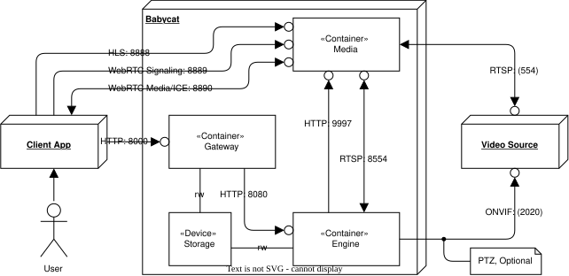

# 3. 시스템 아키텍처 (System Architecture)

## 3.1 아키텍처 개요 (Architecture Overview)

<figure align="center">
  
  <figcaption><em>그림 3-1. 아키텍처 조망도</em></figcaption>
</figure>

`Babycat`은 SRS §2.2의 여섯 구성요소를 각각 하나의 컨테이너로 실현한다(§2.4 (1)). 시스템 외부에는 ***User***가 조작하는 ***Client app***과 라이브 비디오를 제공하는 ***Video source***가 있다.

제어 요청은 ***Client app***에서 출발하여 ***Request router***를 거쳐 각 컴포넌트에 이른다. 인증은 ***Request router*** 한곳에서 이루어지며, 내부로 전달된 요청은 재검증하지 않는다. 라이브 재생 역시 이 경로를 따른다 — HLS 비디오와 WebRTC 시그널링은 ***Request router***가 ***Video streamer***로 중계하고, WebRTC 미디어만 저지연을 위해 ***Video streamer***에서 ***Client app***으로 직접 흐른다(§2.4 (2)).

비디오는 ***Video streamer***를 중심으로 흐른다. ***Video streamer***는 ***Video source***의 RTSP 스트림을 수신하여 내부에 재배포하고, ***Video analyzer***(프레임 추출·VLM 추론)와 ***Event recorder***(사전 구간 버퍼)가 각자 독립된 RTSP 연결로 이를 소비한다. ***Video analyzer***가 이벤트를 판정하면 ***Event recorder***에게 통지하고, ***Event recorder***가 클립과 발생 이력을 저장한다.

***Source controller***는 프로필에 따라 ***Video streamer***에 소스를 설정하고, PTZ 제어를 위해 ***Video source***에 ONVIF로 직접 접속한다. PTZ는 스트림과 무관한 기능이므로 ***Video streamer***를 경유할 이유가 없다.

## 3.2 컴포넌트 구성 (Component Composition)

컨테이너 이름은 구성요소 이름의 마지막 단어를 소문자로 쓴다. 상세 설계는 §4의 각 절에서 다룬다.

|컴포넌트|컨테이너|기반|역할|
|---|---|---|---|
|***Request router***|`router`|FastAPI|단일 외부 진입점. 인증·라우팅, HLS·WHEP 중계, 모니터링 합성|
|***Account manager***|`manager`|FastAPI|자격증명 검증, 토큰 발급·회전·폐기, 계정 데이터베이스 소유|
|***Source controller***|`controller`|FastAPI|비디오 소스 프로필 관리, ***Video streamer*** 소스 설정, PTZ 제어|
|***Video streamer***|`streamer`|MediaMTX|RTSP 수신·재배포, HLS/WebRTC 송출|
|***Video analyzer***|`analyzer`|표준 라이브러리 HTTP 서버 + GStreamer + NanoLLM|프레임 추출, VLM 추론, 키워드 매칭, 이벤트 판정|
|***Event recorder***|`recorder`|FastAPI + GStreamer + ffmpeg|사전 구간 버퍼, 클립·사이드카·발생 이력 저장, 클립·이력 API, 하드웨어 상태 측정|

하드웨어 가속기에 의존하는 컨테이너는 `analyzer`(NVDEC·GPU)와 `recorder`(NVDEC·NVENC) 둘뿐이며, 나머지는 일반 PC에서 개발할 수 있다(SRS §3.4).

영속 데이터는 컴포넌트가 단독 소유한다 — `manager`는 계정 데이터베이스를, `controller`는 프로필 파일을, `recorder`는 이벤트 데이터베이스와 클립 파일을 소유한다. 배치는 §5.3에서 정한다.

## 3.3 컴포넌트 간 의존 관계 (Component Dependencies)

의존의 방향은 다음과 같다. 화살표는 요청을 개시하는 쪽에서 받는 쪽을 향한다.

|의존하는 쪽|의존받는 쪽|수단|성격|
|---|---|---|---|
|***Client app***|***Request router***|HTTP|동기|
|***Client app***|***Video streamer***|WebRTC 미디어(UDP)|스트림|
|***Request router***|***Account manager***|HTTP|동기|
|***Request router***|***Source controller***|HTTP|동기|
|***Request router***|***Video analyzer***|HTTP, SSE|동기·스트림|
|***Request router***|***Event recorder***|HTTP|동기|
|***Request router***|***Video streamer***|HTTP(HLS·WHEP 중계)|동기|
|***Source controller***|***Video streamer***|HTTP(제어 API)|동기|
|***Source controller***|***Video source***|ONVIF|동기|
|***Video streamer***|***Video source***|RTSP|스트림|
|***Video analyzer***|***Video streamer***|RTSP|스트림|
|***Video analyzer***|***Event recorder***|HTTP(이벤트 통지)|동기|
|***Event recorder***|***Video streamer***|RTSP|스트림|

의존 그래프에 순환이 없다. ***Request router***는 모든 컴포넌트를 호출하지만 어떤 컴포넌트도 ***Request router***를 호출하지 않고, ***Video analyzer*** → ***Event recorder*** 방향의 호출만 존재하며 그 역방향이 없기 때문이다. 기동 순서를 하나로 정할 수 있는 근거가 여기에 있다(§3.5).

제어 요청은 모두 동기 호출이나, 장면 분석은 그렇지 않다. ***Video analyzer***는 분석 시작 요청에 대한 응답을 즉시 돌려준 뒤 분석을 계속하므로, 요청의 수명과 분석의 수명이 분리된다. ***Client app***이 분석의 진행 상태를 확인하는 경로는 모니터링 스트림(§6.4)이다.

스트림 의존(RTSP)은 연결의 수명이 길고 상대의 준비 상태에 종속되므로, 동기 호출과 달리 재시도로 확보한다(SRS `FR-046`, §2.4 (5)). ***Source controller***의 제어 API 호출도 기동 시점에는 같은 방식으로 재시도한다(SRS `FR-015`).

## 3.4 프로세스 및 스레드 구조 (Process and Thread Structure)

`router`·`manager`·`controller`는 각각 uvicorn 단일 프로세스로 동작한다. 요청 처리 외의 상주 작업은 `router`의 모니터링 합성 태스크(§6.4)와, `controller`의 PTZ 상태 폴링 및 ***Video streamer*** 소스 설정 주기 점검(§7.5) 스레드뿐이다.

`analyzer`는 주 프로세스와 VLM 자식 프로세스로 나뉜다. 주 프로세스는 GStreamer 파이프라인(자체 스레드 풀), 추론 큐를 소비하는 워커 스레드, HTTP 서버 스레드를 가진다. VLM 모델은 자식 프로세스에 적재하여, 모델 전환(`FR-032`) 시 자식 프로세스의 종료·재기동으로 메모리 반환을 보장한다(`NFR-023`). 추론 한 번이 수 초에 이르는 동안에도 제어 요청과 상태 스트림이 막히지 않도록, 추론은 요청 처리 경로와 분리된 워커에서만 수행한다.

`recorder`는 uvicorn 프로세스 안에 세그먼트 기록용 GStreamer 파이프라인 스레드, 클립 결합 작업 스레드, 하드웨어 상태 측정 루프를 가진다. 클립 결합은 이벤트 통지 요청의 응답과 분리된 작업 스레드에서 수행하여, 결합이 오래 걸려도 통지 경로가 막히지 않게 한다.

`streamer`는 기성품이므로 내부 구조를 `Babycat`이 정하지 않는다.

## 3.5 기동 순서 (Startup Sequence)

Compose의 `depends_on`은 프로세스의 시작 순서만 보장할 뿐 요청을 받을 수 있는 상태인지는 알려주지 않는다(§2.3). 따라서 기동 순서는 참고 정보로만 두고, 준비 대기는 각 컴포넌트의 재시도가 해결한다.

- `streamer`를 가장 먼저 시작한다. `controller`는 저장된 프로필이 있으면 `streamer`의 제어 API에 소스 설정을 재시도하고(SRS `FR-015`), `analyzer`와 `recorder`는 직전 운영 상태가 분석 중이었다면 재배포 스트림 접속을 재시도한다(SRS `FR-046`). 어느 쪽도 다른 컴포넌트의 준비 통지를 기다리지 않는다(§2.4 (5)).
- 재기동 시의 상태 복원(SRS `FR-014`)은 각 컴포넌트가 자기 몫을 스스로 수행한다. `controller`는 저장된 프로필을 다시 적용하고, `analyzer`와 `recorder`는 각자 영속화해 둔 분석 활성 여부를 읽어 이전 상태를 재개한다. 컴포넌트 사이의 복원 조율은 없다.
- 최초 기동에서는 VLM 모델의 사전 컴파일이 수 분에서 수십 분 걸린다(SRS §3.2). 이 동안 `analyzer`만 준비되지 않은 상태이며, ***Request router***는 분석 관련 요청에만 상류 오류(§6.5)로 응답하고 로그인·프로필·클립 조회 등 나머지 기능은 정상 제공한다. 컴포넌트 분리가 이 부분 가용성을 자연히 보장한다.
