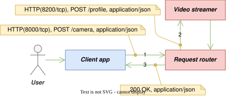
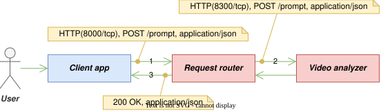
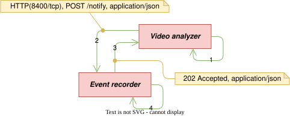
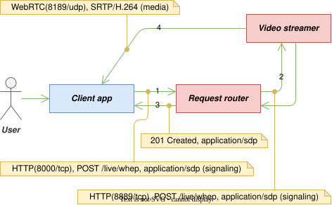

# 6. 인터페이스 설계 (Interface Design)

## 6.1 외부 API (External API)

***Request router***가 노출하는 전체 표면이다. 인증 열의 "필요"는 §6.2의 검증을 통과해야 함을 뜻한다. 요청·응답 본문은 JSON이다(스트림 응답 제외).

### 사용자 계정 인증 및 관리

|경로|메서드|기능|인증|전달 대상|
|---|---|---|---|---|
|`/api/login`|POST|로그인. 기존 세션 대체(`FR-047`) 후 액세스·리프레시 토큰 발급.|불필요|`router` 자체|
|`/api/refresh`|POST|리프레시 토큰으로 액세스 토큰 갱신(회전).|불필요|`router` 자체|
|`/api/logout`|POST|토큰 폐기.|불필요|`router` 자체|
|`/api/change-password`|POST|비밀번호 변경(기존 토큰 전체 폐기).|필요|`router` 자체|
|`/health`|GET|서버 상태 확인.|불필요|`router` 자체|

### 비디오 소스 프로필·PTZ

|경로|메서드|기능|인증|전달 대상|
|---|---|---|---|---|
|`/camera`|GET|비디오 소스 프로필 조회(비밀번호 마스킹).|필요|`streamer`|
|`/camera`|POST|비디오 소스 프로필 등록(`FR-048` — 접속은 스트리밍 시작 시점).|필요|`streamer`|
|`/ptz`|POST|팬·틸트·줌 이동/정지/홈 저장/홈 복귀.|필요|`streamer`|

### 라이브 스트리밍 제어

|경로|메서드|기능|인증|전달 대상|
|---|---|---|---|---|
|`/streaming/start`|POST|라이브 스트리밍 시작(`FR-048`). 등록 프로필을 적용 프로필로 승격하여 소스 연결.|필요|`streamer`|
|`/streaming/stop`|POST|라이브 스트리밍 종료(`FR-049`). 소스 해제와 분석·버퍼 연쇄 정지.|필요|셋 모두|

### 장면 분석

|경로|메서드|기능|인증|전달 대상|
|---|---|---|---|---|
|`/prompt`|POST|VLM 프롬프트·이벤트 키워드 설정. 분석을 시작하지 않는다(`FR-025`).|필요|`analyzer`|
|`/analysis/start`|POST|장면 분석 시작/재시작(`FR-024`). 스트리밍 진행 중이 아니면 거부(`FR-050`). `analyzer`·`recorder`에 병렬 전달(SRS §2.3 (5)).|필요|`analyzer`·`recorder`|
|`/analysis/stop`|POST|장면 분석 종료(`FR-051`). 스트리밍은 유지.|필요|`analyzer`·`recorder`|
|`/vlm/switch`|POST|VLM 모델 전환(`FR-032`, `P3`).|필요|`analyzer`|

### 모니터링

|경로|메서드|기능|인증|전달 대상|
|---|---|---|---|---|
|`/state`|GET|모니터링 스트림(SSE). §6.4 (4)의 합성 결과.|필요|합성|
|`/stream`|GET|VLM 입력 프레임 MJPEG(`FR-044`, `P3`).|필요|`analyzer`|

### 클립·이력

|경로|메서드|기능|인증|전달 대상|
|---|---|---|---|---|
|`/clips`|GET|클립 목록 조회(부분 일치 텍스트·날짜, 페이지네이션).|필요|`recorder`|
|`/clips/{name}`|GET|클립 재생(HTTP Range 지원).|필요|`recorder`|
|`/clips`|DELETE|선택 클립 삭제.|필요|`recorder`|
|`/clips/all`|DELETE|전체 클립 삭제.|필요|`recorder`|
|`/events`|GET|발생 이력 조회(키워드·날짜, 페이지네이션).|필요|`recorder`|
|`/events/{id}`|DELETE|발생 이력 개별 삭제(`FR-035`).|필요|`recorder`|
|`/events`|DELETE|발생 이력 전체 삭제.|필요|`recorder`|

클립·이력의 날짜 필터는 시스템 로컬 시간대(`TZ`)의 달력 날짜를 뜻한다. 이력의 발생 시각은 UTC로 저장되며, 조회 시 날짜 경계를 UTC로 변환해 비교한다.

### 라이브 스트리밍 중계

|경로|메서드|기능|인증|전달 대상|
|---|---|---|---|---|
|`/live/hls/{path}`|GET|HLS 재생목록·세그먼트 중계.|필요|`streamer`|
|`/live/whep`|POST|WebRTC 세션 수립(WHEP).|필요|`streamer`|
|`/live/whep/{session}`|PATCH·DELETE|ICE 갱신·세션 종료.|필요|`streamer`|

`/streaming/start`·`/streaming/stop`·`/analysis/start`·`/analysis/stop`은 모두 멱등이다. 시작 요청은 재시작을 겸하며(`FR-024`·`FR-048`), 병렬 전달의 부분 실패 시 ***Request router***는 오류로 응답하되 이미 성공한 컴포넌트를 되돌리지 않으며, ***Client app***의 재요청이 수복 수단이 된다. 부분 실패의 판정은 전달 실패(무응답·서버 오류)뿐 아니라 대상 컴포넌트가 응답 본문으로 알린 처리 실패도 포함한다 — 실패한 연쇄가 성공으로 보고되면 재요청이라는 수복 수단 자체가 성립하지 않는다.

## 6.2 인증과 토큰 (Authentication and Tokens)

- **액세스 토큰** — HMAC-SHA256 서명 JWT. 페이로드는 사용자 식별자, 만료 시각(발급 후 600초), 세대(epoch)다. ***Request router***가 발급과 검증을 모두 수행하며, 서명 비밀키는 이 컴포넌트에만 주입한다(§2.3).
- **리프레시 토큰** — 임의 난수 토큰. 로그인 유지를 요청한 로그인에서만 발급한다(`FR-002`). 원문은 클라이언트만 보관하고 서버는 해시만 저장하며, 만료는 발급 후 30일이다. 갱신마다 회전한다(`FR-045`).
- **1계정 1로그인** — 로그인 성공은 같은 계정의 기존 세션을 대체한다(`FR-047`). ***Request router***는 새 토큰 발급에 앞서 계정의 리프레시 토큰 전부를 폐기하고 세대를 증가시키므로, 기존 세션의 토큰은 종류를 불문하고 모두 무효가 된다. 진행 중이던 스트림 연결(라이브 재생·모니터링)도 함께 끊는다 — 중계 스트림(SSE·MJPEG)은 전달 루프의 세대 대조로 끊고, ***Request router***를 경유하지 않는 WebRTC 미디어는 수립 시 등록해 둔 WHEP 세션에 종료 요청을 보내 끊으며 — 등록부는 계정 데이터베이스에 영속되어(§5.2) ***Request router***의 재시작이 종료 능력을 잃게 하지 않는다 — HLS·클립 재생은 요청 단위 인증이므로 다음 요청부터 거부된다. 대체된 세션의 ***Client app***은 폐기된 토큰의 거부 응답(§6.5)으로 이를 인지하여, 사용자에게 알리고 로그아웃한다. 세션을 바꾸는 연산 — 로그인에 의한 대체, 토큰 회전, 로그아웃, 비밀번호 변경 — 은 직렬화한다. 대체와 회전이 겹칠 때 회전이 발급한 토큰이 폐기를 비켜가 새 세션 이후까지 유효하게 남는 일을 배제하기 위함이다.
- **폐기** — 새 로그인·로그아웃·비밀번호 변경 시 ***Request router***가 계정의 세대를 증가시킨다. 매 인증마다 토큰의 세대를 계정 데이터베이스의 현재 세대와 대조하므로, 이전 세대의 액세스 토큰은 즉시 거부된다(`FR-003`·`FR-005`·`FR-047`). 발급·검증·폐기가 한 프로세스에 있어 이 대조는 자기 데이터베이스 읽기 한 번이다.
- **토큰 전달** — 원칙은 `Authorization: Bearer` 헤더이고, 헤더를 설정할 수 없는 클라이언트 기능(HLS·SSE·MJPEG·클립 재생)을 위해 `?token=` 쿼리 파라미터를 허용한다.
- **스트림 접근 토큰은 존재하지 않는다** — 단일 진입점 결정(§2.4 (2))으로 모든 재생 요청이 위 검증을 거치므로, 별도 토큰과 그 폐기 지연 문제가 성립하지 않는다.
- **초기 계정** — 최초 기동 시 초기 관리자 계정을 1회 생성하고, 초기 비밀번호가 변경되지 않은 동안 로그인 응답에 변경 필요를 명시한다(`FR-006`). 로그인 연속 10회 실패 시 30분 차단한다(`FR-007`).

## 6.3 컴포넌트 간 인터페이스 (Inter-component Interface)

내부 호출은 컨테이너 네트워크의 HTTP이며 인증을 두지 않는다(§2.2). 내부 포트는 `streamer`의 동반 프로세스 8200, `analyzer` 8300, `recorder` 8400이며 어느 것도 호스트에 공개하지 않는다. 계정 인증은 ***Request router***의 내부 기능이므로 컴포넌트 간 인터페이스가 아니다.

|제공자|경로|호출자|기능|
|---|---|---|---|
|`streamer`(동반 프로세스)|GET·POST `/profile`|`router`|프로필 조회·등록|
|`streamer`(동반 프로세스)|POST `/ptz`|`router`|PTZ 명령|
|`streamer`(동반 프로세스)|POST `/streaming/start`·`/streaming/stop`|`router`|적용 프로필로 소스 연결/해제(스트리밍 시작·종료의 실체)|
|`streamer`(동반 프로세스)|GET `/status`|`router`|PTZ 위치·스트리밍 상태(모니터링 합성용)|
|`analyzer`|POST `/prompt`·`/start`·`/stop`·`/vlm/switch`|`router`|분석 설정·시작·종료·모델 전환|
|`analyzer`|GET `/events`(SSE)·`/stream`(MJPEG)|`router`|분석 상태 스트림·입력 프레임|
|`recorder`|POST `/notify`|`analyzer`|이벤트 통지(매칭 키워드·장면 설명·발생 시각)|
|`recorder`|POST `/buffer/start`·`/buffer/stop`|`router`|세그먼트 버퍼 시작·정지(분석 시작·종료의 일부)|
|`recorder`|GET·DELETE `/clips`(계열)·`/events`(계열)|`router`|§6.1 클립·이력 기능의 실체|
|`recorder`|GET `/status`|`router`|하드웨어·저장·세그먼트 상태(모니터링 합성용)|
|`streamer`(MediaMTX)|HLS(8888)·WHEP(8889)|`router`|재생 중계의 상류|
|`streamer`(MediaMTX)|RTSP(8554)|`analyzer`·`recorder`|재배포 스트림 수신|

MediaMTX 제어 API(9997)는 동반 프로세스가 같은 컨테이너 안에서 localhost로 호출하는 프로세스 간 인터페이스이므로 이 표에 넣지 않는다(§4.2).

이벤트 통지(`/notify`)의 본문은 매칭 키워드 목록, 장면 설명 텍스트, 판정 시각, VLM이 본 마지막 프레임의 캡처 시각, 그리고 진단용 추론 시각 정보다. 프레임 캡처 시각은 클립 창의 기준점이므로 계약 필드다(§7.2). ***Event recorder***는 수신 즉시 응답하고 클립 결합은 작업 스레드에서 수행한다(§3.4). 통지가 유실되면 그 이벤트는 기록되지 않으며, 이를 좁히는 재전송은 두지 않는다 — 추론 주기가 수 초이므로 지속되는 상황은 다음 추론에서 다시 판정된다.

## 6.4 스트리밍 인터페이스 (Streaming Interface)

### (1) RTSP 수신

***Video streamer***는 프로필의 RTSP URL로 ***Video source***에 접속하여 수신한다(`IF-002`). ***Video analyzer***와 ***Event recorder***는 각자 독립된 RTSP 연결로 재배포 스트림(`rtsp://streamer:8554/live`)을 소비한다. 접속 실패의 재시도(`FR-046`)는 간격을 늘려가며 무한 반복하되 실현 수단은 컴포넌트별로 다르다 — ***Event recorder***는 기록 파이프라인 재기동을 초기 1초에서 2배씩 상한 10초로, ***Video analyzer***는 워치독 재시작 간격을 기본 15초에서 2배씩 상한 60초로 늘리며, 프레임이 흐르기 시작하면 기본 간격으로 복귀한다. 소스 적용의 재시도(`FR-015`)는 `streamer`의 동반 프로세스가 같은 컨테이너의 MediaMTX를 상대로 수행하는 내부 절차다(§4.2).

### (2) HLS·WHEP 중계

- HLS: ***Request router***가 `/live/hls/{path}`를 `streamer`의 HLS 서버로 중계한다. MediaMTX의 재생목록은 상대 URL을 쓰므로 본문 재작성이 필요 없다.
- WHEP: `POST /live/whep`를 중계하고, 응답의 `Location` 헤더(세션 자원 경로)를 ***Request router*** 경로로 재작성한다. 이후의 `PATCH`(ICE 후보)·`DELETE`(종료)도 같은 경로로 중계한다.
- SSE·MJPEG 중계를 포함한 모든 스트림 중계는 버퍼링 없이 도착분을 즉시 전달한다. 유휴 SSE가 정체로 오인되지 않도록 중계 읽기에 타임아웃을 두지 않는다.

### (3) WebRTC 미디어 직접 경로

시그널링에서 교환된 ICE 자격으로 ***Client app***과 ***Video streamer*** 사이에 UDP(8189) 미디어 연결이 직접 수립된다. ***Video streamer***는 외부 도달 가능한 호스트 IP를 ICE 후보로 광고한다(SRS §3.2).

### (4) 모니터링 스트림 합성

`FR-042`·`FR-043`의 실시간 제공은 ***Request router***의 합성으로 실현한다. ***Request router***는 `analyzer`의 SSE를 구독하여 추론·파이프라인 상태 변화를 즉시 받고, `recorder`와 `streamer`의 `/status`를 주기(2초)로 수집하여, 세 출처를 하나의 평면 JSON 스냅숏으로 병합해 `/state` SSE로 내보낸다. 어느 출처가 응답하지 않으면 그 필드 그룹을 결측으로 표시하고 나머지는 계속 전달한다 — 관측은 부분 실패에도 살아 있어야 한다(§2.1 목표 3).

클립의 생성·삭제는 이 스냅숏의 클립 계수 변화로 드러나고, ***Client app***은 계수 변화를 클립 목록 갱신의 신호로 쓴다. 따라서 계수의 변화는 그 변화가 목록 조회로 관찰 가능해진 뒤에만 일어나야 한다 — 신호가 데이터보다 앞서면 갱신이 새 클립을 얻지 못한 채 끝나고, 다음 계수 변화가 있을 때까지 목록에 반영되지 않는다.

## 6.5 오류 응답 규약 (Error Response Convention)

- 오류 본문은 `{"detail": <문자열>}` 하나로 통일한다.
- 상태 코드: 400(요청 형식 오류), 401(인증 실패·폐기된 토큰), 404(대상 부재), 409(전제 불충족 — 라이브 스트리밍이 진행 중이 아닌 분석 시작, `FR-050`), 429(로그인 차단, `FR-007`), 502(내부 컴포넌트 무응답·서버 오류).
- 전제의 확인이 불가능한 상태는 전제 불충족과 구분한다 — 확인 대상 컴포넌트가 응답하지 않으면 409가 아니라 502다.
- 401의 `detail`은 토큰의 만료·무효와 폐기를 구분한다. ***Client app***은 이 구분으로 세션 대체 통지 여부를 판정한다(`FR-047`, §6.2).
- 내부 컴포넌트의 5xx와 무응답은 ***Request router***가 502로 정규화한다. 4xx는 의미를 보존한 채 그대로 전달한다.
- 인증 없는 요청이 인증 필요 경로에 닿으면 기능을 불문하고 401이다(`FR-008`).

## 6.6 동작별 메시지 흐름 (Message Flows by Operation)

SRS §2.3의 아홉 동작을 이동(메시지) 단위로 상세화하고, SRS §2.3에 없는 실시간 모니터링을 (10)으로 보탠다. 각 그림의 간선 번호는 본문의 단계 번호와 일대일로 대응한다. 표기 규약은 다음과 같다.

- `형태:`는 한 이동의 전송 형식이다. 요청은 "규약(포트), 메서드 경로, 본문 타입"으로, 응답은 "상태 코드, 본문 타입"으로 적는다. 응답은 요청과 같은 연결로 돌아오므로 포트를 반복하지 않는다.
- 본문이 없는 이동은 본문 타입을 생략한다.
- 그림과 형태는 대표 성공 경로만 나타낸다. 오류 응답은 §6.5의 규약을 따른다.
- 고정 번호가 아닌 포트(***Video source***의 RTSP·ONVIF 포트)는 프로필 항목 이름으로 적는다.

### (1) 자격증명 및 로그인 유지

<figure align="center">
  
  <figcaption><em>그림 6-1. 자격증명 및 로그인 유지</em></figcaption>
</figure>

1. ***User***가 자격증명을 입력하여 로그인을 요청하면, ***Client app***은 이 요청을 ***Request router***에게 전달한다. 로그인 유지 여부도 함께 전달한다.
    - 형태: `HTTP(8000/tcp), POST /api/login, application/json`
    - 자격증명과 로그인 유지 여부는 JSON 본문에 담긴다.
    - 프로토타이핑은 HTTP를 사용하였으나, 프로덕션용은 반드시 HTTPS로 구현하여야 한다(SRS §2.7).
2. ***Request router***는 전달받은 자격증명을 검증한다.
    - 검증은 내부에 저장된 계정 정보를 이용해 외부 통신 없이 수행한다.
    - 입력된 비밀번호를 내부에 저장된 해시와 대조한다.
3. ***Request router***는 검증 결과를 ***Client app***에게 응답한다.
    - 형태: `200 OK, application/json`
    - 자격증명이 정당하면, 그 계정의 기존 로그인 세션을 무효화한 뒤(`FR-047`, §6.2) 액세스 토큰을 발급하여 응답에 담는다.
    - 자격증명이 정당하고 사용자가 로그인 유지를 요청했다면, 리프레시 토큰도 함께 발급한다.
    - 자격증명이 정당하지 않으면 거부한다.
4. ***Client app***은 이후의 모든 요청에 발급받은 액세스 토큰을 함께 보낸다.
    - ***Request router***는 토큰이 없거나 유효하지 않은 요청을 거부한다.

계정 관리의 나머지 동작은 ***Request router*** 안에서 끝나는 같은 왕복 구조이므로 형태만 적는다. 의미는 §6.2가 정의한다.

- 토큰 갱신: `HTTP(8000/tcp), POST /api/refresh, application/json` → `200 OK, application/json`. 리프레시 토큰을 제출하면 회전된 토큰 쌍을 반환한다.
- 로그아웃: `HTTP(8000/tcp), POST /api/logout, application/json` → `200 OK, application/json`. 리프레시 토큰이 없는 세션은 액세스 토큰을 `Authorization` 헤더로 대신 제출한다.
- 비밀번호 변경: `HTTP(8000/tcp), POST /api/change-password, application/json` → `200 OK, application/json`. 성공하면 계정의 기존 토큰 전체가 폐기된다.

### (2) 비디오 소스 프로필 등록

<figure align="center">
  
  <figcaption><em>그림 6-2. 비디오 소스 프로필 등록</em></figcaption>
</figure>

1. ***User***가 ***Video source*** 프로필을 입력하여 등록을 요청하면, ***Client app***은 이 요청을 ***Request router***에게 전달한다.
    - 형태: `HTTP(8000/tcp), POST /camera, application/json`
    - 프로필은 JSON 본문에 담긴다.
2. ***Request router***는 전달받은 요청을 ***Video streamer***에게 중개한다.
    - 형태: `HTTP(8200/tcp), POST /profile, application/json`
3. ***Video streamer***는 프로필을 저장하고, 그 결과를 ***Request router***를 거쳐 ***Client app***에게 응답한다.
    - 형태: `200 OK, application/json`

### (3) 라이브 스트리밍 시작과 종료

<figure align="center">
  
  <figcaption><em>그림 6-3. 라이브 스트리밍 시작과 종료</em></figcaption>
</figure>

1. ***User***가 라이브 스트리밍 시작을 요청하면, ***Client app***은 이 요청을 ***Request router***에게 전달한다.
    - 형태: `HTTP(8000/tcp), POST /streaming/start`
    - 이 요청은 본문이 없다.
2. ***Request router***는 전달받은 요청을 ***Video streamer***에게 중개한다.
    - 형태: `HTTP(8200/tcp), POST /streaming/start, application/json`
3. ***Video streamer***는 그 시점의 등록 프로필을 적용 프로필로 삼아, RTSP로 ***Video source***에 접속하여 스트림을 수신한다.
    - 형태: `RTSP(rtsp_port/tcp), RTP/H.264`
    - 접속 포트는 프로필에 등록된 `rtsp_port`를 따른다.
4. ***Video streamer***는 수신한 스트림을 내부에 재배포하고, 수락 결과를 ***Request router***를 거쳐 ***Client app***에게 응답한다.
    - 형태(재배포): `RTSP(8554/tcp), RTP/H.264`
    - 형태(응답): `200 OK, application/json`

종료는 같은 왕복 구조에 연쇄 정지가 더해진다. ***Request router***는 종료 요청을 ***Video streamer***(소스 해제)·***Video analyzer***(분석 정지)·***Event recorder***(버퍼 정지)에게 병렬 전달한다(`FR-049`).

- 종료 요청: `HTTP(8000/tcp), POST /streaming/stop` → `200 OK, application/json`
- 내부 전달: `HTTP(8200/tcp), POST /streaming/stop, application/json` · `HTTP(8300/tcp), POST /stop, application/json` · `HTTP(8400/tcp), POST /buffer/stop, application/json`

### (4) 비디오 분석 조건 설정

<figure align="center">
  
  <figcaption><em>그림 6-4. 비디오 분석 조건 설정</em></figcaption>
</figure>

1. ***User***가 프롬프트와 이벤트 키워드를 입력하여 설정을 요청하면, ***Client app***은 이 요청을 ***Request router***에게 전달한다.
    - 형태: `HTTP(8000/tcp), POST /prompt, application/json`
    - 프롬프트와 이벤트 키워드는 JSON 본문에 담긴다.
2. ***Request router***는 전달받은 요청을 ***Video analyzer***에게 중개한다.
    - 형태: `HTTP(8300/tcp), POST /prompt, application/json`
3. ***Video analyzer***는 프롬프트와 이벤트 키워드를 저장하고, 그 결과를 ***Request router***를 거쳐 ***Client app***에게 응답한다.
    - 형태: `200 OK, application/json`
    - 설정이 저장되더라도 분석은 자동으로 시작되지 않는다(`FR-025`).

### (5) 비디오 분석 시작과 종료

<figure align="center">
  
  <figcaption><em>그림 6-5. 비디오 분석 시작과 종료</em></figcaption>
</figure>

1. ***User***가 분석 시작을 요청하면, ***Client app***은 이 요청을 ***Request router***에게 전달한다.
    - 형태: `HTTP(8000/tcp), POST /analysis/start`
    - 이 요청은 본문이 없다.
    - 라이브 스트리밍이 진행 중이 아니면, ***Request router***는 이 요청을 거부한다(`FR-050`, §6.5).
2. ***Request router***는 이 요청을 ***Video analyzer***와 ***Event recorder***에게 병렬 전달한다.
    1. 형태(→***Video analyzer***): `HTTP(8300/tcp), POST /start, application/json`
    2. 형태(→***Event recorder***): `HTTP(8400/tcp), POST /buffer/start, application/json`
    3. 둘이 모두 수락하면, ***Request router***는 ***Client app***에게 성공을 응답한다. 형태: `200 OK, application/json`
3. ***Video analyzer***는 재배포 스트림에 접속하여 장면 분석 파이프라인을 가동한다.
    - 형태: `RTSP(8554/tcp), RTP/H.264`
4. ***Event recorder***는 재배포 스트림에 접속하여, 이벤트 직전 구간을 클립에 담기 위한 최근 구간의 비디오 보관을 시작한다.
    - 형태: `RTSP(8554/tcp), RTP/H.264`

종료는 같은 왕복 구조로, 라이브 스트리밍을 유지한 채 분석과 보관만 정지한다(`FR-051`).

- 종료 요청: `HTTP(8000/tcp), POST /analysis/stop` → `200 OK, application/json`
- 내부 전달: `HTTP(8300/tcp), POST /stop, application/json` · `HTTP(8400/tcp), POST /buffer/stop, application/json`

### (6) 이벤트 감지와 기록 - 자동 실행

<figure align="center">
  
  <figcaption><em>그림 6-6. 이벤트 감지와 기록 - 자동 실행</em></figcaption>
</figure>

1. ***Video analyzer***는 장면 분석 파이프라인이 생성한 텍스트에 ***User***가 설정한 이벤트 키워드가 포함되어 있는지 검사한다.
2. 키워드가 포함되어 있으면, ***Video analyzer***는 그 상황을 이벤트 발생으로 판단하여 ***Event recorder***에게 기록을 요청한다.
    - 형태: `HTTP(8400/tcp), POST /notify, application/json`
    - 일치한 키워드, 생성된 텍스트, 판정 시각과 마지막 프레임 시각은 JSON 본문에 담긴다(§6.3).
3. ***Event recorder***는 응답 후 기록을 준비한다.
    - 형태: `202 Accepted, application/json`
4. ***Event recorder***는 그 구간의 비디오 클립과 발생 이력을 저장한다.
    - 가용 저장 공간이 임계치 이하로 떨어지면, 가장 오래된 클립과 이력부터 순차적으로 삭제하여 공간을 확보한다(`FR-033`).

### (7) 라이브 비디오 재생

#### HLS 기반

<figure align="center">
  
  <figcaption><em>그림 6-7-a. 라이브 비디오 재생 - HLS</em></figcaption>
</figure>

1. ***User***가 라이브 비디오 재생을 요청하면, ***Client app***은 이 요청을 ***Request router***에게 전달한다.
    - 형태: `HTTP(8000/tcp), GET /live/hls/index.m3u8`
    - 재생은 라이브 스트리밍이 진행 중일 때 가능하다(`FR-048`).
2. ***Request router***는 전달받은 요청을 ***Video streamer***에게 중개한다.
    - 형태: `HTTP(8888/tcp), GET /live/index.m3u8`
3. ***Video streamer***는 라이브 비디오를 HLS로 전달한다.
    - HLS 비디오는 ***Request router***가 ***Client app***에게 중계한다.
    - 형태(재생목록): `200 OK, application/vnd.apple.mpegurl`
    - 형태(세그먼트): `200 OK, video/mp4(segment)`

#### WebRTC 기반

<figure align="center">
  
  <figcaption><em>그림 6-7-b. 라이브 비디오 재생 - WebRTC</em></figcaption>
</figure>

1. ***User***가 라이브 비디오 재생을 요청하면, ***Client app***은 이 요청을 ***Request router***에게 전달한다.
    - 형태: `HTTP(8000/tcp), POST /live/whep, application/sdp`
    - 재생은 라이브 스트리밍이 진행 중일 때 가능하다(`FR-048`).
2. ***Request router***는 전달받은 요청을 ***Video streamer***에게 중개한다.
    - 형태: `HTTP(8889/tcp), POST /live/whep, application/sdp`
3. ***Video streamer***는 시그널링에 응답한다.
    - 형태: `201 Created, application/sdp`
4. ***Video streamer***는 저지연을 위해 ***Request router***를 거치지 않고 WebRTC 비디오를 ***Client app***에게 직접 전달한다.
    - 형태: `WebRTC(8189/udp), SRTP/H.264`

### (8) 비디오 소스 PTZ 제어

<figure align="center">
  
  <figcaption><em>그림 6-8. 비디오 소스 PTZ 제어</em></figcaption>
</figure>

1. ***User***가 팬·틸트·줌 제어를 요청하면, ***Client app***은 이 요청을 ***Request router***에게 전달한다.
    - 형태: `HTTP(8000/tcp), POST /ptz, application/json`
    - 동작의 종류(이동·정지·홈 저장·홈 복귀)와 이동량은 JSON 본문에 담긴다.
2. ***Request router***는 전달받은 요청을 ***Video streamer***에게 전달한다.
    - 형태: `HTTP(8200/tcp), POST /ptz, application/json`
3. ***Video streamer***는 요청을 수신했다는 응답을 ***Request router***를 거쳐 ***Client app***에게 보낸다.
    - 형태: `200 OK, application/json`
    - 이 응답이 ONVIF 제어가 완료되었다는 뜻은 아니다.
4. ***Video streamer***는 ONVIF를 이용하여 ***Video source***를 직접 제어한다.
    - 형태: `HTTP(onvif_port/tcp), ONVIF PTZ 서비스, application/soap+xml`
    - 접속 포트는 프로필에 등록된 `onvif_port`를 따른다.
    - ***Video source***가 ONVIF를 지원하지 않거나 접근을 허용하지 않으면, 요청을 별도의 오류 없이 무시한다(`FR-020`).

### (9) 이벤트 클립과 이력 관리

#### 이벤트 클립 및 이력 조회

<figure align="center">
  
  <figcaption><em>그림 6-9-a. 이벤트 클립 및 이력 조회</em></figcaption>
</figure>

1. ***User***가 조건(키워드·날짜)으로 조회를 요청하면, ***Client app***은 이 요청을 ***Request router***에게 전달한다.
    - 형태(이력): `HTTP(8000/tcp), GET /events`
    - 형태(클립 목록): `HTTP(8000/tcp), GET /clips`
    - 조회 조건은 쿼리 문자열에 담긴다.
2. ***Request router***는 이 요청을 ***Event recorder***에게 중개한다. ***Event recorder***는 조건에 일치하는 이력을 조회하고, ***Request router***는 그 결과를 ***Client app***에게 전달한다.
    - 형태(이력): `HTTP(8400/tcp), GET /events`
    - 형태(클립 목록): `HTTP(8400/tcp), GET /clips`
    - 형태(응답): `200 OK, application/json`

#### 이벤트 클립 재생·삭제

<figure align="center">
  
  <figcaption><em>그림 6-9-b. 이벤트 클립 재생·삭제</em></figcaption>
</figure>

1. ***User***가 특정 클립의 재생이나 삭제를 요청하면, ***Client app***은 이 요청을 ***Request router***에게 전달한다.
    - 형태(재생): `HTTP(8000/tcp), GET /clips/{name}`
    - 형태(삭제): `HTTP(8000/tcp), DELETE /clips, application/json`
    - 삭제할 클립의 이름들은 JSON 본문에 담긴다.
2. ***Request router***는 이 요청을 ***Event recorder***에게 중개한다.
    - 형태(재생): `HTTP(8400/tcp), GET /clips/{name}`
    - 형태(삭제): `HTTP(8400/tcp), DELETE /clips, application/json`
3. ***Event recorder***는 그 클립을 반환하거나 삭제하고, ***Request router***는 그 결과를 ***Client app***에게 전달한다.
    - 형태(재생 응답): `200 OK, video/mp4`
      - 구간(Range) 요청에는 `206 Partial Content`로 응답한다.
    - 형태(삭제 응답): `200 OK, application/json`

### (10) 시스템 실시간 모니터링

합성 구조는 §6.4 (4)가 정의하며, 여기서는 오가는 메시지만 적는다.

1. ***Client app***이 상태 스트림 구독을 요청하면, ***Request router***는 병합 스냅숏을 지속하여 전달한다.
    - 형태: `HTTP(8000/tcp), GET /state`
    - 형태(응답): `200 OK, text/event-stream`
2. ***Request router***는 ***Video analyzer***의 상태 스트림을 상시 구독한다.
    - 형태: `HTTP(8300/tcp), GET /events`
    - 형태(응답): `200 OK, text/event-stream`
3. ***Request router***는 ***Video streamer***와 ***Event recorder***의 상태를 주기적으로 수집한다.
    - 형태(→***Video streamer***): `HTTP(8200/tcp), GET /status`
    - 형태(→***Event recorder***): `HTTP(8400/tcp), GET /status`
    - 형태(응답): `200 OK, application/json`
4. ***User***가 VLM 입력 프레임 보기를 요청하면, ***Client app***은 ***Request router***를 거쳐 ***Video analyzer***의 프레임 스트림을 받는다.
    - 형태(***Client app***→): `HTTP(8000/tcp), GET /stream`
    - 형태(중개): `HTTP(8300/tcp), GET /stream`
    - 형태(응답): `200 OK, multipart/x-mixed-replace`
