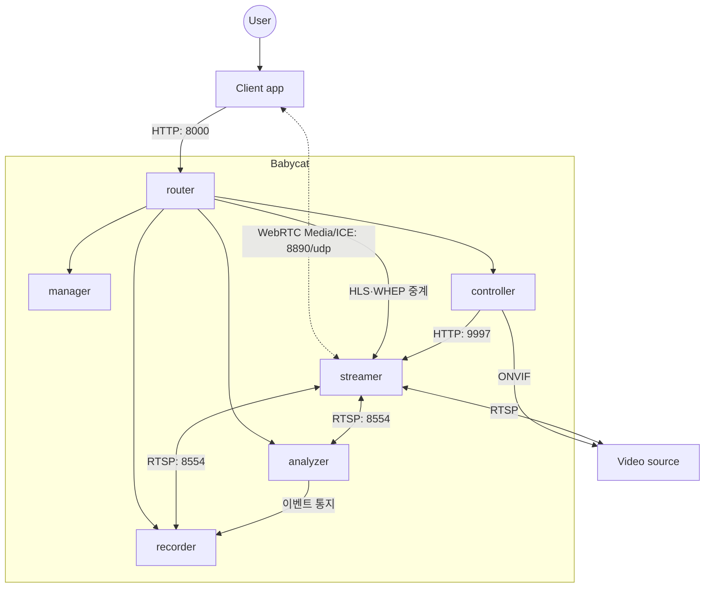

```mermaid
flowchart TB
    User(("User"))
    ClientApp["Client app"]
    VideoSource["Video source"]

    subgraph Babycat
        Router["router"]
        Manager["manager"]
        Controller["controller"]
        Streamer["streamer"]
        Analyzer["analyzer"]
        Recorder["recorder"]
    end

    User --> ClientApp
    ClientApp -->|"HTTP: 8000"| Router
    ClientApp <-.->|"WebRTC Media/ICE: 8890/udp"| Streamer

    Router --> Manager
    Router --> Controller
    Router --> Analyzer
    Router --> Recorder
    Router -->|"HLS·WHEP 중계"| Streamer

    Controller -->|"HTTP: 9997"| Streamer
    Controller -->|"ONVIF"| VideoSource

    Streamer <-->|"RTSP"| VideoSource
    Streamer <-->|"RTSP: 8554"| Analyzer
    Streamer <-->|"RTSP: 8554"| Recorder

    Analyzer -->|"이벤트 통지"| Recorder
```
