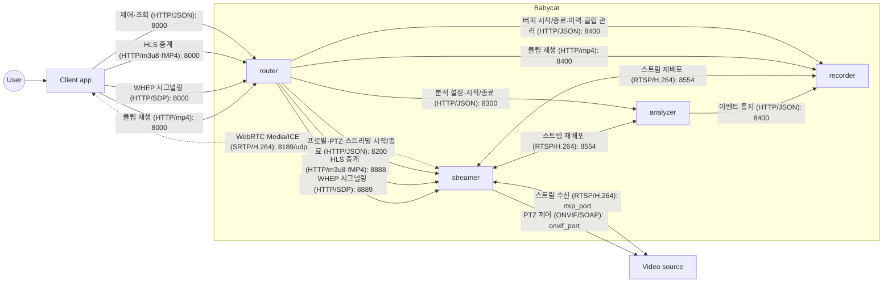

```mermaid
flowchart LR
    User(("User"))
    ClientApp["Client app"]
    VideoSource["Video source"]

    subgraph Babycat
        Router["router"]
        Streamer["streamer"]
        Analyzer["analyzer"]
        Recorder["recorder"]
    end

    User --> ClientApp

    ClientApp -->|"제어·조회 (HTTP/JSON): 8000"| Router
    ClientApp -->|"HLS 중계 (HTTP/m3u8·fMP4): 8000"| Router
    ClientApp -->|"WHEP 시그널링 (HTTP/SDP): 8000"| Router
    ClientApp -->|"클립 재생 (HTTP/mp4): 8000"| Router
    ClientApp <-.->|"WebRTC Media/ICE (SRTP/H.264): 8189/udp"| Streamer

    Router -->|"프로필·PTZ·스트리밍 시작/종료 (HTTP/JSON): 8200"| Streamer
    Router -->|"HLS 중계 (HTTP/m3u8·fMP4): 8888"| Streamer
    Router -->|"WHEP 시그널링 (HTTP/SDP): 8889"| Streamer
    Router -->|"분석 설정·시작/종료 (HTTP/JSON): 8300"| Analyzer
    Router -->|"버퍼 시작/종료·이력·클립 관리 (HTTP/JSON): 8400"| Recorder
    Router -->|"클립 재생 (HTTP/mp4): 8400"| Recorder

    Streamer <-->|"스트림 수신 (RTSP/H.264): rtsp_port"| VideoSource
    Streamer -->|"PTZ 제어 (ONVIF/SOAP): onvif_port"| VideoSource
    Streamer <-->|"스트림 재배포 (RTSP/H.264): 8554"| Analyzer
    Streamer <-->|"스트림 재배포 (RTSP/H.264): 8554"| Recorder

    Analyzer -->|"이벤트 통지 (HTTP/JSON): 8400"| Recorder
```
