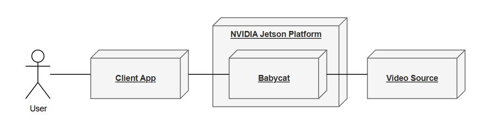
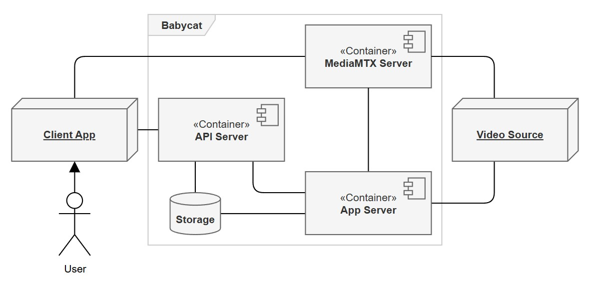

# 2. 전체 설명 (Overall Description)

## 2.1 전체 시스템 구성 (Overall System Configuration)

비디오 분석 기술이 요구되는 분야는 다양하나, 특정 도메인에 VLM을 적용할 수 있을지는 실제로 적용해 보기 전에는 판단하기 어렵다. `Babycat`은 이러한 대상 도메인에 대한 VLM 적용 가능성을 검증하기 위해 설계된 백엔드이다. `그림 2-1`은 `Babycat`이 놓이는 전체 환경을 조망한 다이어그램이다.

<figure align="center">
  <picture>
    <source media="(prefers-color-scheme: dark)" srcset="figs/2-1-dark.jpg">
    <source media="(prefers-color-scheme: light)" srcset="figs/2-1-light.jpg">
    
  </picture>
  <figcaption><em>그림 2-1. 프로젝트 조망도</em></figcaption>
</figure>

`Babycat`은 NVIDIA Jetson Platform에서 동작하는 독립 실행형 백엔드로, ***Video Source***로부터 비디오 스트림을 수신하여 VLM으로 분석하고 ***Client App***의 요청에 적절한 서비스를 제공한다. `그림 2-2`는 `Babycat`을 둘러싼 전체 시스템 구성을 나타내며, 외부 시스템/요소 2개, 내부 컴포넌트 3개, 내부 자원 1개로 이루어진다. 각 구성 요소의 세부 내용은 아래 표와 같다.

<figure align="center">
  <picture>
    <source media="(prefers-color-scheme: dark)" srcset="figs/2-2-dark.jpg">
    <source media="(prefers-color-scheme: light)" srcset="figs/2-2-light.jpg">
    
  </picture>
  <figcaption><em>그림 2-2. 전체 시스템 구성도</em></figcaption>
</figure>

|구분|이름|역할|
|---|---|---|
|외부 시스템/요소|***Client App***|`Babycat` 사용자용 프론트엔드 앱|
|외부 시스템/요소|***Video Source***|`Babycat`에 라이브 비디오를 제공하는 외부 소스|
|내부 컴포넌트|***API Server***|단일 외부 진입점으로 요청을 처리하거나 프록시|
|내부 컴포넌트|***App Server***|VLM 추론, 장면 이벤트 감지·기록, 실시간 모니터링 피딩 등|
|내부 컴포넌트|***MediaMTX Server***|라이브 비디오 스트림의 처리·분배|
|내부 자원|***Storage***|설정 파일이나 비디오 클립 저장, 데이터베이스 등 제공|

## 2.2 전체 동작 방식 (Overall Operation)

Babycat의 동작은 시스템이 사용자 개입 없이 상시 수행하는 자율 분석과, 사용자의 요청에 따라 일어나는 상호작용의 두 갈래로 나뉜다.

자율 분석은 비디오 소스 프로필과 이벤트 키워드가 설정된 뒤 시작된다. ***App Server***는 ***Video Source***의 스트림을 ***MediaMTX Server***를 거쳐 수신하여 주기적으로 프레임을 추출하고, 이를 VLM으로 분석한다. 분석 결과에 설정된 키워드가 포함되면 이벤트로 판정하여 해당 시점의 비디오 클립과 발생 이력을 ***Storage***에 저장한다. 이 과정은 사용자 개입 없이 상시 반복된다.

사용자 상호작용은 ***Client App***을 통한 요청으로 이루어진다. 사용자는 비디오 소스 프로필·이벤트 키워드·VLM 모델을 설정하고, 지원되는 경우 카메라의 PTZ를 제어하며, 라이브 비디오를 재생하고, 저장된 클립과 이벤트 이력을 조회·관리하며, 분석 과정과 시스템 상태를 모니터링한다. 모든 요청은 ***API Server***를 단일 진입점으로 거치며, 라이브 비디오만은 ***MediaMTX Server***로부터 직접 전달받는다.

## 2.3 주요 기능 (Functions)

### (1) 사용자 계정 인증 및 관리 기능

***Client App***을 통해 `Babycat`에 접근하려면 인증된 사용자 계정이 필요하다. 이 기능군은 사용자 계정을 인증하거나 관리한다.

|기능|설명|
|---|---|
|1-1|로그인 할 수 있다.|
|1-2|로그아웃 할 수 있다.|
|1-3|로그인 상태를 유지할 수 있다.|
|1-4|로그인 비밀번호를 변경할 수 있다.|

다수 계정이 필요하지 않은 상황이라는 판단 하에, 새로운 계정을 추가하거나 기존 계정을 삭제하는 기능은 포함하지 않았다. 따라서 상기한 기능군은 `admin` 계정만을 대상으로 한다. 만약 다수 계정이 필요한 상황이라면 언제든지 기능을 추가할 수 있다.

### (2) 비디오 소스 프로필 관리 기능

***Video Source*** 프로필은 해당 소스에 접근하기 위한 정보의 집합이다. 이 기능군은 그 프로필을 관리한다.

|기능|설명|
|---|---|
|2-1|프로필을 등록할 수 있다.|
|2-2|프로필을 조회할 수 있다.|
|2-3|프로필을 수정할 수 있다.|

### (3) 비디오 소스 PTZ 제어 기능

***Video Source***의 팬·틸트·줌(PTZ)을 제어하는 기능군이다.

|기능|설명|
|---|---|
|3-1|비디오 소스의 팬·틸트·줌을 조정할 수 있다.|
|3-2|진행 중인 팬·틸트·줌 동작을 정지할 수 있다.|
|3-3|현재 팬·틸트·줌 위치를 홈 위치로 저장할 수 있다.|
|3-4|저장한 홈 위치로 되돌아갈 수 있다.|

***Video Source***는 추상적인 개념이지만, PTZ 제어는 실재하는 카메라를 원격지에서 물리적으로 움직이는 행위이다. 따라서 본 기능군은 ***Video Source***가 ONVIF PTZ를 지원하는 IP 카메라라고 가정하며, 비디오 파일·미디어 서버·ONVIF를 지원하지 않거나 접근이 제한된 카메라에서는 PTZ 제어 요청이 별도의 오류 없이 무시된다.

### (4) 라이브 스트리밍 기능

***Video Source***의 라이브 비디오를 재생하는 기능이다.

|기능|설명|
|---|---|
|4-1|라이브 비디오를 재생할 수 있다.|

라이브 비디오는 HLS 또는 WebRTC 중 하나로 전달되며, 스트리밍 인증 방식은 아직 미결이다(D-B).

### (5) 장면 이벤트 감지 기능

VLM으로 장면을 분석하고, 사용자가 설정한 키워드에 해당하는 이벤트를 감지하고, 그 시점의 비디오 클립을 저장하는 기능이다.

|기능|설명|
|---|---|
|5-1|장면 분석에 사용할 VLM 프롬프트를 설정할 수 있다|
|5-2|이벤트로 간주할 키워드를 설정할 수 있다|
|5-3|사용할 VLM 모델을 선택할 수 있다|
|5-4|비디오 소스 프로필을 적용하여 분석을 시작·갱신할 수 있다|
|5-5|설정된 키워드에 해당하는 이벤트를 자동으로 감지하고 비디오 클립을 저장한다|

5-1부터 5-3은 사용자가 분석 조건을 설정하는 기능이고, 5-4는 그 설정을 적용하여 분석을 시작하는 사용자 동작이며, 5-5는 적용된 설정에 따라 사용자의 개입 없이 시스템이 수행하는 자동 동작이다.

### (6) 비디오 클립 관리 기능

저장된 비디오 클립을 조회·재생·삭제하고, 이벤트 발생 이력을 조회·삭제하는 기능이다.

|기능|설명|
|---|---|
|6-1|저장된 클립을 조건(키워드·날짜)으로 조회할 수 있다|
|6-2|클립을 재생할 수 있다|
|6-3|클립을 선택 또는 전체 삭제할 수 있다|
|6-4|이벤트 발생 이력을 조회할 수 있다|
|6-5|이벤트 발생 이력을 삭제할 수 있다|

### (7) 시스템 실시간 모니터링 기능

VLM 분석 과정과 시스템 상태를 실시간으로 확인하는 기능이다.

|기능|설명|
|---|---|
|7-1|VLM에 입력되는 비디오를 실시간으로 확인할 수 있다|
|7-2|분석 상태와 하드웨어 상태(온도·메모리 등)를 실시간으로 확인할 수 있다|

## 2.4 사용자 계층과 특징 (User Classes and Characteristics)

### 운영자
- 카메라가 설치된 현장을 관리하며 Client App을 통해 Babycat과 상호작용하는 주 사용자이다.
- 카메라 프로필 및 이벤트 키워드 설정, 카메라 PTZ 제어, 라이브 스트림 모니터링, 이벤트 클립 조회·재생·삭제를 주로 수행한다.
- VLM이나 AI에 대한 전문 지식 없이도 기본 기능을 사용할 수 있어야 한다.

### 관리자
- Jetson Board에 Babycat을 배포하고 유지 관리하는 사람이다.
- Docker 및 Linux에 대한 기본 지식이 요구된다.
- 초기 환경 설정(환경 변수, 네트워크, VLM 모델 선택 등)을 담당한다.

## 2.5 가정과 종속관계 (Assumptions and Dependencies)

### 가정

- Babycat은 VLM 도입 검토를 위해 설계되었다. 만약 프로덕션용 백엔드로 활용할 계획이라면, 대상 도메인이 VLM으로 장면을 충분히 잘 묘사하며 키워드 매칭 방식으로 이벤트를 감지하기에 적합하여야 한다. 이 가정이 성립하지 않으면 활용이 어려울 수 있다.
- Babycat은 원활한 시스템 구동과 VLM 로드를 위해 메모리 용량이 16GB 이상인 Jetson Board를 사용한다고 가정한다. 만약 이보다 메모리 볼륨이 더 작은 환경이라면 VLM 로드가 실패할 수 있다.
- NanoLLM(dustynv/jetson-containers)은 향후에도 Jetson Platform을 지원하며 프로젝트 호환성이 유지될 것이라고 가정한다. 만약 프로젝트가 중단되거나 호환성이 깨질 경우 VLM 추론 스택 전체를 다른 것으로 교체해야 할 수 있다.

### 종속관계

- Babycat은 하드웨어 비디오 디코더/인코더가 탑재된 Jetson Module(Orin NX 이상 급)에서 동작하도록 설계되었다. 이 하드웨어가 제공되지 않으면 소프트웨어 디코더/인코더를 GStreamer 파이프라인 코드에 직접 추가해야 한다.
- Babycat은 JetPack 6.2를 기준으로 개발되었다. 다른 버전의 JetPack에서는 원활한 구동이 보장되지 않는다.
- RTSP Source는 H.264로 인코딩된 비디오 스트림을 제공해야 한다. 다른 코덱으로 인코딩된 스트림은 아직 지원하지 않는다.

## 2.6 단계별 요구사항 (Apportioning of Requirements)

1인 프로젝트이고 출시 일정이 확정되지 않은 특성상, 날짜 기반 버전보다는 기능 단위로 단계를 나누어 작성한다.

### v1.0 (기준 버전)

- API Server를 단일 진입점으로 하는 아키텍처를 구현한다.
- 단일 카메라 프로필을 지원한다.
- H.264 RTSP 소스에 대한 VLM 기반 이벤트 감지 및 클립 저장을 지원한다.
- HLS/WebRTC 라이브 스트리밍을 지원한다.
- 클립 조회, 재생, 삭제를 지원한다.
- ONVIF PTZ 제어(지원 카메라에 한함)를 지원한다.
- JWT 기반 사용자 인증을 지원한다.

### 이후 버전으로 미루는 기능

|기능|아키텍처 영향|
|---|---|
|다중 카메라 지원|단일 카메라를 전제한 파이프라인 구조 및 카메라 프로필 데이터 모델을 전면 재설계해야 한다.|
|H.264 외 코덱(H.265 등) 지원|GStreamer 파이프라인에서 코덱 처리를 추상화해야 한다.|
|이벤트 푸시 알림|외부 푸시 서비스(FCM 등) 연동이 추가되어 2.1의 외부 시스템 구성이 변경된다. API Server에 디바이스 토큰 관리가 필요하다.|

장기 영상 트렌드 분석과 Jetson 외 환경 지원은 이후 버전으로 미루는 기능이 아니라 범위 밖이다. (1.2 참조)

## 2.7 하위 호환성 (Backward Compatibility)

이 시스템은 첫 버전이기 때문에 하위 호환성을 고려할 필요가 없다.
