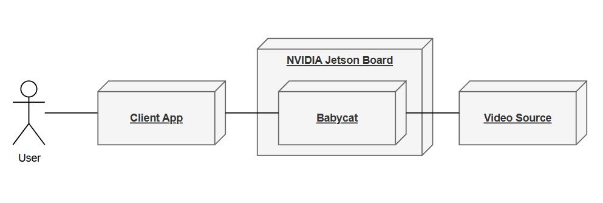
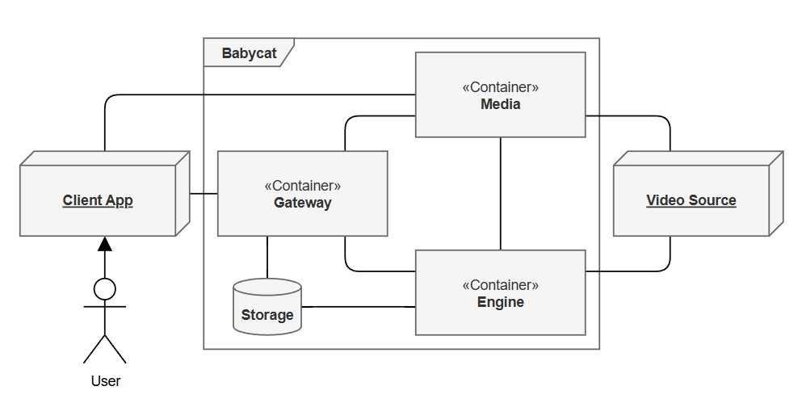

# 2. 전체 설명 (Overall Description)

## 2.1 프로젝트 범위 (Project Scope)

<figure align="center">
  <picture>
    <source media="(prefers-color-scheme: dark)" srcset="figs/2-1_dark.jpg">
    <source media="(prefers-color-scheme: light)" srcset="figs/2-1_light.jpg">
    
  </picture>
  <figcaption><em>그림 2-1. 프로젝트 조망도</em></figcaption>
</figure>

- 프로젝트명은 `Babycat`이다.
- `Babycat`은 특정 도메인에 VLM을 적용할 수 있을지 검토하기 위한 백엔드이다.
- `Babycat`은 키워드 매칭 방식의 이벤트 감지 기능을 제공한다.
- `Babycat`은 이벤트가 감지된 시점의 구간을 비디오 클립으로 자동 저장하는 기능을 제공한다.
- `Babycat`은 장기적인 비디오 변화 추이에 대한 요약 및 분석 기능은 제공하지 않는다.
- `Babycat`은 NVIDIA Jetson Board에서 구동되도록 설계되었다.
- 외부 시스템인 ***Client App***과 ***Video Source***는 `Babycat` 설계 범위에 속하지 않는다.

## 2.2 전체 시스템 구성 (Overall System Configuration)

<figure align="center">
  <picture>
    <source media="(prefers-color-scheme: dark)" srcset="figs/2-2_dark.jpg">
    <source media="(prefers-color-scheme: light)" srcset="figs/2-2_light.jpg">
    
  </picture>
  <figcaption><em>그림 2-2. 전체 시스템 구성도</em></figcaption>
</figure>

`Babycat`은 ***Video Source***로부터 비디오 스트림을 수신하여 VLM으로 분석하고, ***Client App***의 요청에 적절한 서비스를 제공한다. 전체 시스템은 외부 시스템 2개, 내부 컴포넌트 3개, 내부 자원 1개로 구성된다.

|구분|이름|설명|
|---|---|---|
|외부 시스템|***Client App***|`Babycat` 사용자용 프론트엔드 앱|
|외부 시스템|***Video Source***|`Babycat`에 라이브 비디오를 제공하는 외부 소스|
|내부 컴포넌트|***Gateway***|단일 외부 진입점, 사용자 인증 및 요청 처리·프록시|
|내부 컴포넌트|***Engine***|VLM 추론, 이벤트 감지·기록, 프로필 관리, PTZ 제어 등|
|내부 컴포넌트|***Media***|라이브 비디오 스트림의 처리·분배(MediaMTX 기반)|
|내부 자원|***Storage***|설정 파일·비디오 클립 저장, 데이터베이스 등|

## 2.3 전체 동작 방식 (Overall Operation)

`Babycat`은 상호작용 방식과 자율분석 방식을 동시에 지원한다. 상호작용은 사용자가 ***Client App***을 통해 시스템을 직접 조작하는 방식으로, 구체적인 예는 아래와 같다.

- ***Video Source*** 접속 프로필과 분석에 사용할 프롬프트·이벤트 키워드를 설정한다.
- ***Media***가 중계하는 라이브 비디오를 HLS 또는 WebRTC로 재생한다.
- ONVIF PTZ를 지원하는 카메라에 한하여 팬·틸트·줌을 제어한다.
- 저장된 비디오 클립과 이벤트 발생 이력을 조건으로 조회하거나 삭제한다.
- VLM 분석 상태와 하드웨어 상태(온도·메모리 등)를 실시간으로 확인한다.

한편, 자율분석은 조건이 만족되었을 때 사용자의 개입 없이 상시 반복되는 방식으로, 구체적인 예는 아래와 같다.

- ***Engine***이 라이브 비디오에서 주기적으로 프레임을 추출하여 VLM으로 분석하고, 장면을 설명하는 텍스트를 생성한다.
- 생성된 텍스트에 설정된 키워드가 포함되면 해당 상황을 이벤트로 판정한다.
- 이벤트로 판정되면 그 구간의 비디오 클립과 발생 이력을 ***Storage***에 저장한다.
- 저장 공간이 부족해지면 가장 오래된 클립과 이력부터 자동으로 삭제하여 공간을 확보한다.

## 2.4 제공 기능 (Functions)

### (1) 사용자 계정 인증 및 관리 기능

***Client App***을 통해 `Babycat`에 접근하려면 인증된 사용자 계정이 필요하다. 이 기능군은 사용자 계정을 인증하거나 관리한다.

|기능|설명|
|---|---|
|1-1|로그인할 수 있다.|
|1-2|로그아웃할 수 있다.|
|1-3|로그인 상태를 유지할 수 있다.|
|1-4|로그인 비밀번호를 변경할 수 있다.|

다수 계정이 필요하지 않은 상황이라는 판단 하에, 새로운 계정을 추가하거나 기존 계정을 삭제하는 기능은 포함하지 않았다. 따라서 상기한 기능군은 `admin` 계정만을 대상으로 한다. 만약 다수 계정이 필요한 상황이라면 언제든지 기능을 추가할 수 있다.

### (2) 비디오 소스 프로필 관리 기능

프로필은 ***Video Source***에 접근하기 위한 정보의 집합으로, IP 주소, 포트, 스트림 경로, 아이디와 비밀번호 등으로 구성된다. 이 기능군은 프로필 정보를 관리한다.

|기능|설명|
|---|---|
|2-1|프로필을 등록할 수 있다.|
|2-2|프로필을 조회할 수 있다.|
|2-3|프로필을 수정할 수 있다.|

***Video Source***로는 RTSP 카메라, 비디오 파일, USB 카메라, 미디어 서버 등 여러 유형이 존재하나, 본 기능군은 그중 가장 대중적인 RTSP 카메라만을 대상으로 한다. 다른 유형의 소스를 지원해야 하는 상황이라면 언제든지 기능을 추가할 수 있다.

### (3) 비디오 소스 PTZ 제어 기능

이 기능군은 ***Video Source***의 팬(Pan)·틸트(Tilt)·줌(Zoom)을 제어한다.

|기능|설명|
|---|---|
|3-1|팬·틸트·줌을 조정할 수 있다.|
|3-2|진행 중인 팬·틸트·줌 동작을 정지할 수 있다.|
|3-3|현재 팬·틸트·줌 위치를 홈 위치로 저장할 수 있다.|
|3-4|저장한 홈 위치로 팬·틸트·줌을 되돌릴 수 있다.|

***Video Source***가 ONVIF를 지원하지 않거나 접근을 허용하지 않으면, 요청이 별도의 오류 없이 무시된다.

### (4) 라이브 스트리밍 기능

이 기능군은 ***Video Source***의 라이브 비디오를 재생한다.

|기능|설명|
|---|---|
|4-1|라이브 비디오를 재생할 수 있다.|

라이브 비디오는 HLS 또는 WebRTC 중 하나로 전달되며, 재생하려면 ***Gateway***가 발급한 인증 토큰이 있어야 한다.

### (5) 장면 분석 및 이벤트 기록 기능

이 기능군은 `Babycat`의 핵심 기능군으로, 지정한 VLM과 프롬프트로 장면을 분석하여 사용자가 설정한 키워드에 해당하는 이벤트를 감지하고 그 발생 이력과 비디오 클립을 저장한다.

|기능|설명|
|---|---|
|5-1|목록에서 VLM을 선택할 수 있다.|
|5-2|프롬프트를 설정할 수 있다.|
|5-3|이벤트 키워드를 설정할 수 있다.|
|5-4|장면 분석을 시작·재시작할 수 있다.|
|5-5|이벤트 감지 시 발생 이력과 비디오 클립을 자동으로 저장한다.|

### (6) 이벤트 발생 이력 관리 기능

이 기능군은 저장된 이벤트 발생 이력을 조회·삭제한다.

|기능|설명|
|---|---|
|6-1|이벤트 발생 이력을 조건(키워드·날짜)으로 조회할 수 있다.|
|6-2|이벤트 발생 이력을 선택 삭제 또는 전체 삭제할 수 있다.|

### (7) 비디오 클립 관리 기능

이 기능군은 저장된 비디오 클립을 조회·재생·삭제한다.

|기능|설명|
|---|---|
|7-1|클립을 조건(키워드·날짜)으로 조회할 수 있다.|
|7-2|클립을 재생할 수 있다.|
|7-3|클립을 선택 삭제 또는 전체 삭제할 수 있다.|

### (8) 시스템 실시간 모니터링 기능

이 기능군은 VLM 분석 과정과 하드웨어 상태를 실시간으로 확인한다.

|기능|설명|
|---|---|
|8-1|VLM에 입력되는 비디오를 확인할 수 있다.|
|8-2|분석 상태와 하드웨어 상태(온도·메모리 등)를 확인할 수 있다.|

## 2.5 사용자 계층과 특징 (User Classes and Characteristics)

`Babycat`의 사용자 계층은 ***Client App***을 통해 시스템을 운영·감시하는 **운영자** 하나로 단일하며, 권한 등급을 구분하지 않는다.

- v1.0은 단일 `admin` 계정만을 대상으로 하며, 계정의 추가·삭제 기능은 두지 않는다. 다수 계정이 필요한 경우는 이후 버전의 범위로 미룬다(§2.4).
- 운영자는 소수임을 전제한다. 이 전제에 따라 시스템은 API 동시 요청 처리량에 대한 요구사항을 두지 않는다(§5.2).
- `Babycat`은 백엔드이므로 운영자는 프론트엔드인 ***Client App***을 통해 `Babycat`과 소통한다(§4.2). 또한 운영자가 3장에 기술된 환경을 이해하고 다룰 수 있다고 전제한다.

## 2.6 가정과 종속 관계 (Assumptions and Dependencies)

### 가정

- `Babycat`은 메모리 16GB 이상의 Jetson Board를 가정한다. 이보다 작은 환경에서는 VLM 로드가 실패할 수 있다.
- NanoLLM(`dustynv/jetson-containers`)이 향후에도 Jetson Platform 지원과 프로젝트 호환성을 유지한다고 가정한다. 지원이 끊기거나 호환성이 깨지면 VLM 추론 스택 전체를 교체해야 할 수 있다.

### 종속 관계

- `Babycat`은 하드웨어 비디오 디코더/인코더를 갖춘 Jetson Module(Orin NX 이상)에서 동작하도록 설계되었다. 해당 하드웨어가 없으면 소프트웨어 디코더/인코더를 GStreamer 파이프라인에 직접 추가해야 한다.
- `Babycat`은 JetPack 6.2를 기준으로 개발되었다. 다른 버전에서는 정상 구동이 보장되지 않는다.
- ***Video Source***는 H.264로 인코딩된 비디오 스트림을 제공해야 한다. 다른 코덱은 아직 지원하지 않는다.

## 2.7 단계별 요구사항 (Apportioning of Requirements)

출시 일정이 확정되지 않은 소규모 프로젝트 특성상, 날짜가 아닌 기능 단위로 단계를 나눈다.

### v1.0 (기준 버전)

- ***Gateway***를 단일 진입점으로 하는 아키텍처를 구현한다.
- 단일 카메라 프로필을 지원한다.
- H.264 RTSP 소스의 VLM 기반 이벤트 감지와 클립·이력 저장을 지원한다.
- HLS/WebRTC 라이브 스트리밍을 지원한다.
- 클립 조회·재생·삭제를 지원한다.
- 이벤트 발생 이력 조회·삭제를 지원한다.
- 분석 과정과 하드웨어 상태의 실시간 모니터링을 지원한다.
- ONVIF PTZ 제어(지원 카메라에 한함)를 지원한다.
- JWT 기반 사용자 인증을 지원한다.

### 이후 버전으로 미루는 기능

|기능|아키텍처 영향|
|---|---|
|다중 카메라 지원|단일 카메라를 전제한 파이프라인 구조 및 카메라 프로필 데이터 모델을 전면 재설계해야 한다.|
|H.264 외 코덱 지원|GStreamer 파이프라인에서 코덱 처리를 추상화해야 한다.|
|이벤트 푸시 알림|외부 푸시 서비스(FCM 등) 연동으로 §2.2의 외부 시스템 구성이 바뀌고, ***Gateway***에 디바이스 토큰 관리가 추가된다.|

장기 비디오 트렌드 분석과 Jetson 외 환경 지원은 이후 버전 기능이 아니라 범위 밖이다(§2.1).

## 2.8 하위 호환성 (Backward Compatibility)

이 시스템은 첫 버전이기 때문에 아직 하위 호환성을 고려할 필요가 없다.
