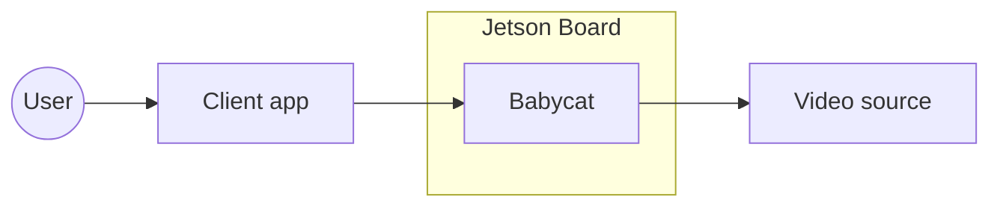
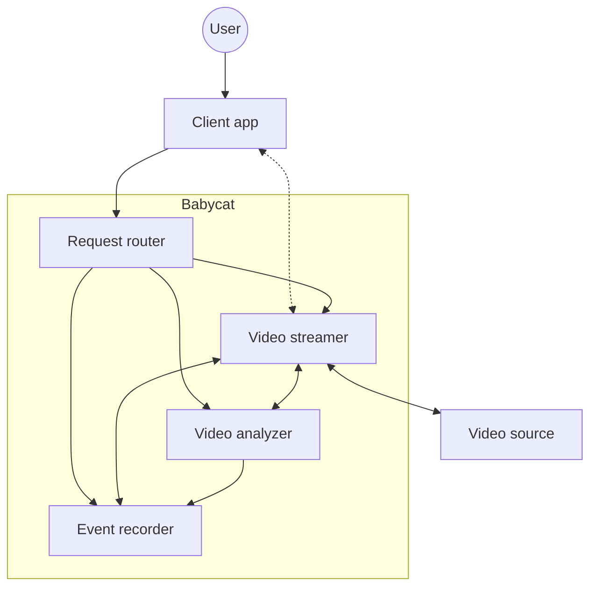

# 2. 전체 설명 (Overall Description)

## 2.1 제품 조망 (Product Perspective)

아래 조망도는 `Babycat`과 ***Jetson Board***, 그리고 외부 시스템인 ***Client app***과 ***Video source***의 관계를 나타낸다. 이후의 다이어그램에서는 ***Jetson Board***를 생략한다.

```mermaid
flowchart LR
    User(("User"))
    ClientApp["Client app"]
    VideoSource["Video source"]

    subgraph JetsonBoard["Jetson Board"]
        Babycat["Babycat"]
    end

    User --> ClientApp
    ClientApp --> Babycat
    Babycat --> VideoSource
```

- ***User*** : ***Client app***을 통해 `Babycat`을 사용하는 사용자.
- ***Client app*** : `Babycat` 사용자용 프론트엔드 앱.
- ***Video source*** : `Babycat`에 라이브 비디오를 제공하는 외부 소스(예: IP 카메라).

## 2.2 전체 시스템 구성 (Overall System Configuration)

```mermaid
flowchart TB
    User(("User"))
    ClientApp["Client app"]
    VideoSource["Video source"]

    subgraph Babycat
        RequestRouter["Request router"]
        VideoStreamer["Video streamer"]
        VideoAnalyzer["Video analyzer"]
        EventRecorder["Event recorder"]
    end

    User --> ClientApp
    ClientApp --> RequestRouter
    ClientApp <-.-> VideoStreamer

    RequestRouter --> VideoStreamer
    RequestRouter --> VideoAnalyzer
    RequestRouter --> EventRecorder

    VideoStreamer <--> VideoSource
    VideoStreamer <--> VideoAnalyzer
    VideoStreamer <--> EventRecorder

    VideoAnalyzer --> EventRecorder
```

- ***Request router*** : 단일 외부 진입점. 계정을 인증·관리하며, 요청에 실린 액세스 토큰을 검증하여 라우팅한다.
- ***Video streamer*** : 비디오 소스 프로필을 관리하고 비디오 스트림을 재배포하며, PTZ를 제어한다.
- ***Video analyzer*** : VLM을 이용해 비디오를 분석하고, 이벤트 발생 유무를 판단한다.
- ***Event recorder*** : 이벤트 클립과 이력을 저장·관리하고, 하드웨어 상태를 측정한다.

## 2.3 전체 동작 방식 (Overall Operation)

### (1) 자격증명 및 로그인 유지

1. ***User***가 자격증명을 입력하여 로그인을 요청하면 ***Client app***은 이 요청을 ***Request router***에게 전달한다.
    - 자격증명과 함께, 로그인을 유지할 것인지에 대한 선택 사항도 함께 전달한다.
2. ***Request router***는 전달받은 자격증명을 검증한다.
3. ***Request router***는 검증 결과를 ***Client app***에게 응답한다.
    - 자격증명 O, 로그인 유지 X → 기존 로그인 세션 무효화, 액세스 토큰 발급
    - 자격증명 O, 로그인 유지 O → 기존 로그인 세션 무효화, 액세스 토큰 + 리프레시 토큰 발급
    - 자격증명 X → 거부
4. 이후 ***Request router***는 액세스 토큰이 유효하지 않은 서비스 요청을 모두 거부한다.

### (2) 라이브 스트리밍 - 비디오 소스 프로필 등록

1. ***User***가 ***Video source*** 프로필을 입력하여 등록을 요청하면, ***Client app***은 이 요청을 ***Request router***에게 전달한다.
2. ***Request router***는 전달받은 요청을 ***Video streamer***에게 중개한다.
3. ***Video streamer***는 프로필을 등록(저장)하고, 그 결과를 ***Request router***를 거쳐 ***Client app***에게 응답한다.
    - 주의: 등록은 라이브 스트리밍 시작 과정을 수반하지 않는다.

### (3) 라이브 스트리밍 - 시작과 종료

1. ***User***가 라이브 스트리밍 시작을 요청하면, ***Client app***은 이 요청을 ***Request router***에게 전달한다.
2. ***Request router***는 전달받은 요청을 ***Video streamer***에게 중개한다.
3. ***Video streamer***는 등록된(저장된) 프로필이 가리키는 ***Video source***에 접속(RTSP)하여 스트림을 수신한다.
    - 이미 스트림을 수신 중이라면 라이브 스트리밍을 재시작한다. 비디오 분석은 유지되며, 스트림 공백 후 자동으로 재개된다.
    - 스트림이 수신되는 동안 프로필이 변경(재등록)되더라도 라이브 스트리밍은 자동으로 재시작되지 않는다.
      - 근거: §2.3 (2)의 3의 서술 → 등록은 라이브 스트리밍 시작 과정을 수반하지 않는다.
4. ***Video streamer***는 수신한 스트림을 내부에 재배포하고, 그 결과를 ***Request router***를 거쳐 ***Client app***에게 응답한다.
5. ***User***가 ***Client app***을 통해 ***Request router***에 라이브 스트리밍 종료를 요청하면, ***Request router***는 ***Video streamer***에 접속 해제를 요청하고, 진행 중이던 비디오 분석의 종료(§2.3 (5)의 5)도 함께 수행한다.
    - 근거: §2.3 (5)의 2의 서술 → 비디오 분석은 라이브 스트리밍이 진행 중일 때만 가능하다.
    - 주의: 스트림 연결 장애는 정상 종료가 아니다. 시스템은 기존 프로필로 재연결을 자동으로 시도한다.

### (4) 비디오 분석 - 조건 설정

1. ***User***가 프롬프트와 이벤트 키워드를 입력하여 설정을 요청하면, ***Client app***은 이 요청을 ***Request router***에게 전달한다.
2. ***Request router***는 전달받은 요청을 ***Video analyzer***에게 중개한다.
3. ***Video analyzer***는 프롬프트와 이벤트 키워드를 설정(저장)하고, 그 결과를 ***Request router***를 거쳐 ***Client app***에게 응답한다.
    - 주의: 설정은 분석 시작 과정을 수반하지 않는다.

### (5) 비디오 분석 - 시작과 종료

1. ***User***가 분석 시작을 요청하면, ***Client app***은 이 요청을 ***Request router***에게 전달한다.
2. ***Request router***는 라이브 스트리밍(§2.3 (3)) 여부에 따라 요청을 처리한다.
    - 진행 중 O → ***Video analyzer***·***Event recorder***에게 병렬 전달
    - 진행 중 X → 거부
3. ***Video analyzer***는 재배포 스트림에 접속하여 비디오 분석 파이프라인을 가동한다.
4. ***Event recorder***는 재배포 스트림에 접속하여, 이벤트 직전 비디오를 클립에 담을 수 있도록 최근 구간의 비디오 보관을 시작한다.
5. ***User***가 분석 종료를 요청하면, ***Request router***는 ***Video analyzer***와 ***Event recorder***에게 정지를 전달한다. 라이브 스트리밍은 유지된다.

### (6) 이벤트 감지와 기록 (자동 실행)

1. ***Video analyzer***는 비디오 분석 파이프라인이 생성한 텍스트에 ***User***가 설정한 이벤트 키워드가 포함되어 있는지 검사한다.
2. 키워드가 포함되어 있으면, ***Video analyzer***는 그 상황을 이벤트 발생으로 판단하여 ***Event recorder***에게 기록을 요청한다.
3. ***Event recorder***는 요청을 접수했다는 응답을 즉시 보내고, 기록을 준비한다.
4. ***Event recorder***는 그 구간의 비디오 클립과 발생 이력을 저장한다.
    - 가용 저장 공간이 임계치 이하로 떨어지면, 가장 오래된 클립과 이력부터 순차적으로 삭제하여 공간을 확보한다.

### (7) 라이브 비디오 재생

1. ***User***가 라이브 비디오 재생을 요청하면, ***Client app***은 이 요청을 ***Request router***에게 전달한다.
2. ***Request router***는 전달받은 요청을 ***Video streamer***에게 중개한다.
3. ***Video streamer***는 라이브 비디오를 HLS/WebRTC로 전달한다.
    - HLS 비디오는 ***Request router***가 ***Client app***에게 중계한다.
    - WebRTC 비디오는 저지연을 위해 ***Request router***를 거치지 않고 ***Video streamer***가 ***Client app***에게 직접 전달한다.
    - 주의: 재생은 라이브 스트리밍이 진행 중일 때 가능하다.
4. ***Client app***은 전달받은 비디오를 ***User***에게 재생한다.

### (8) 비디오 소스 PTZ 제어

1. ***User***가 팬·틸트·줌 제어를 요청하면, ***Client app***은 이 요청을 ***Request router***에게 전달한다.
2. ***Request router***는 전달받은 요청을 ***Video streamer***에게 전달한다.
3. ***Video streamer***는 요청을 수신했다는 응답을 ***Request router***를 거쳐 ***Client app***에게 보낸다.
    - 이 응답이 PTZ 제어를 완료했다는 뜻은 아니다.
4. ***Video streamer***는 ONVIF를 이용하여 ***Video source***를 직접 제어한다.
    - ***Video source***가 ONVIF를 지원하지 않거나 접근을 허용하지 않으면, 요청을 별도의 오류 없이 무시한다.
    - 주의: 라이브 스트리밍이 진행 중일 때 PTZ 제어가 가능하며, 라이브 스트리밍이 종료되면 PTZ 연결도 종료된다.

### (9) 이벤트 클립과 이력 관리

1. ***User***가 조건(키워드·날짜)으로 조회를 요청하면, ***Client app***은 이 요청을 ***Request router***에게 전달한다.
2. ***Request router***는 이 요청을 ***Event recorder***에게 중개한다.
3. ***Event recorder***는 조건에 일치하는 이력을 조회하고, 그 결과를 ***Request router***를 거쳐 ***Client app***에게 응답한다.
4. ***User***가 특정 클립의 재생이나 삭제를 요청하면, ***Client app***은 이 요청을 ***Request router***에게 전달한다.
5. ***Request router***는 이 요청을 ***Event recorder***에게 중개한다.
6. ***Event recorder***는 그 클립을 반환하거나 삭제하고, 그 결과를 ***Request router***를 거쳐 ***Client app***에게 응답한다.

## 2.4 제공 기능 (Functions)

- **사용자 계정 인증 및 관리** (§7.1) — ***Client app***이 `Babycat`에 접근하려면 인증을 거쳐야 한다. 인증된 ***User***는 로그인 유지를 선택해 재로그인 없이 상태를 유지할 수 있으며, 자신의 비밀번호를 변경할 수 있다. 계정 추가·삭제 기능은 두지 않으며, `admin` 계정 하나만을 대상으로 한다. 다수 계정 지원은 차기 버전의 범위다(§2.7).
- **비디오 소스 프로필 관리** (§7.2) — 프로필은 ***Video source***에 접근하기 위한 정보의 집합으로, IP 주소, 포트, 스트림 경로, 자격증명 등으로 구성된다. ***User***는 프로필을 등록·조회·수정할 수 있다. 여러 소스 유형 가운데 가장 대중적인 RTSP 카메라만을 대상으로 하며, 다른 유형은 차기 버전의 범위다(§2.7).
- **비디오 소스 PTZ 제어** (§7.3) — ***User***는 ***Video source***의 팬·틸트·줌을 조작하고, 홈 위치를 저장하고 그 위치로 복귀시킬 수 있다. ***Video source***가 ONVIF를 지원하지 않거나 접근을 허용하지 않으면 시스템은 요청을 별도의 오류 없이 무시한다.
- **라이브 스트리밍** (§7.4) — ***User***는 등록된 프로필로 ***Video source*** 스트리밍을 시작·종료하고, 진행 중인 라이브 비디오를 재생할 수 있다. 비디오는 HLS/WebRTC로 전달되며, 재생 요청 역시 인증을 거쳐야 한다.
- **비디오 분석 및 이벤트 기록** (§7.5) — `Babycat`의 핵심 기능군이다. 설정된 VLM과 ***User***가 입력한 프롬프트로 비디오를 분석하고, ***User***가 설정한 키워드에 해당하는 상황을 이벤트로 감지하여 그 구간의 비디오 클립과 발생 이력을 자동으로 저장한다. 분석은 라이브 스트리밍이 진행 중일 때 시작할 수 있으며, 스트리밍을 유지한 채 분석만 종료할 수도 있다.
- **이벤트 발생 이력 관리** (§7.6) — ***User***는 저장된 이벤트 발생 이력을 조건(키워드·날짜)으로 조회하고 삭제할 수 있다.
- **비디오 클립 관리** (§7.7) — ***User***는 저장된 비디오 클립을 조건(키워드·날짜)으로 조회·재생·삭제할 수 있다.
- **시스템 실시간 모니터링** (§7.8) — ***User***는 VLM 분석 과정과 하드웨어 상태(온도, 메모리 등)를 실시간으로 확인할 수 있다.

## 2.5 사용자 계층과 특징 (User Classes and Characteristics)

- 연구자
  - VLM이 자기 분야의 비디오를 인식할 수 있는지 시험하려는 사람이다.
  - 프롬프트와 이벤트 키워드를 바꾸어 가며 감지 결과가 어떻게 달라지는지 비교한다.
  - 저장된 클립과 발생 이력을 검토하여 VLM 판정의 실용성을 평가한다.
- 개발자
  - 자신의 감시 서비스 및 앱을 만들려는 사람이다.
  - HTTP API와 라이브 스트림에 자신의 ***Client app***을 연동한다.
  - Jetson Board와 Docker를 다룰 수 있다.
- 현장 관리자
  - 영상을 외부로 내보낼 수 없는 현장에서 카메라를 감시해야 하는 사람이다.
  - 감시할 상황을 키워드로 등록해 두고, 이벤트가 감지되면 그 구간의 클립만 확인한다.
  - 화면을 종일 관찰하지는 않는다.

## 2.6 가정과 종속 관계 (Assumptions and Dependencies)

- 키워드 매칭 방식을 이용해 목적 이벤트를 유의미한 수준으로 감지할 수 있다고 가정한다.
- 개인영상정보 관련 법규가 구동을 제한하지 않는다고 가정한다.
- LAN, VPN 등 신뢰할 수 있는 내부 네트워크 안에서만 구동된다고 가정한다.
- NanoLLM 베이스 이미지를 지속적으로 보존하고 배포할 수 있다고 가정한다.
- ***Video source***는 H.264로 인코딩된 비디오 스트림을 RTSP로 제공할 수 있다고 가정한다.
- 하드웨어 비디오 디코더·인코더를 갖추고 메모리가 16GB 이상인 Jetson Module을 사용한다고 가정한다(§3.1 (1)).
- JetPack 6.2.1, Docker 29.1.3, NVIDIA Container Toolkit 1.16.2와 호환되는 환경을 갖춰야 한다(§3.1 (2)).
- PTZ 제어 기능은 ***Video source***가 ONVIF를 지원해야만 사용할 수 있다.

## 2.7 단계별 요구사항 (Apportioning of Requirements)

소규모 프로젝트 특성상, 날짜가 아닌 기능 단위로 단계를 나눈다. ***Request router***를 단일 진입점으로 하여 제공 기능(§2.4)의 여덟 기능군을 모두 구현한다(v1.0). 단, ***Video source***는 H.264 RTSP 카메라 한 대로 한정한다. 첫 버전 출시 후, 차기 버전에서 아래 기능을 구현한다.

- 다중 카메라 지원 : 단일 카메라를 전제한 파이프라인 구조와 프로필 데이터 모델을 재설계해야 한다.
- RTSP 외 ***Video source*** 유형 지원 : 소스 유형과 프로필 데이터 모델을 소스별로 나누어야 한다.
- H.264 외 코덱 지원 : GStreamer 파이프라인에서 코덱 처리를 추상화해야 한다.
- 다수 계정 지원 : 단일 `admin` 계정을 전제한 인증 구조에 계정 관리와 권한 구분을 더해야 한다.
- 이벤트 푸시 알림 : 외부 푸시 서비스(FCM 등) 연동으로 외부 시스템 구성이 바뀌고, ***Request router***에 디바이스 토큰 관리가 추가된다.
- 전송 구간 HTTPS 암호화 : 인증서의 발급·신뢰 배포 체계를 마련하고, ***Request router***에 TLS 종단을 더해야 한다.

장기 비디오 트렌드 분석과 Jetson 외 환경은 `Babycat` 개발 범위를 벗어난다.

## 2.8 하위 호환성 (Backward Compatibility)

이 시스템은 첫 버전이기 때문에 아직 하위 호환성을 고려할 필요가 없다.
