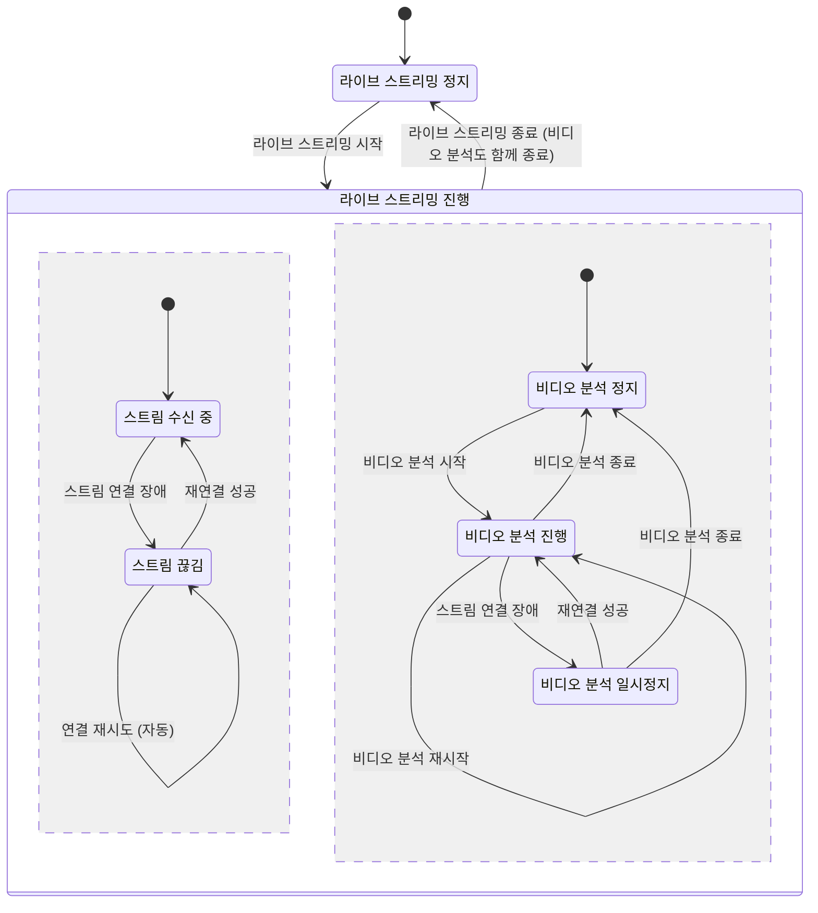

# 7. 기능 요구사항 (Functional Requirements)

## 7.1 사용자 계정 인증 및 관리 (User Account Authentication and Management)

- `FR-001` 시스템은 사용자가 ***Client app***을 통해 올바른 자격증명으로 로그인하는 시점에, 외부 접근 권한 제어를 목적으로 그 ***Client app***에게 액세스 토큰(Access token)을 발급해야 한다.
  - 액세스 토큰은 시스템이 자신의 모든 기능, 데이터, 미디어에 대한 외부 접근 권한을 제어하기 위한 목적으로 사용하는 인증 수단이다.
  - 액세스 토큰은 페이로드에 사용자 식별자와 만료 시각을 포함하며, 서버의 공유 비밀키로 서명하는 자체 검증형 JWT 방식으로 구성한다.
  - 액세스 토큰의 만료 시각은 발급 시점을 기준으로 600초(10분) 후로 설정한다.
  - 리프레시 토큰이 없는 상태에서 액세스 토큰이 만료될 경우, 시스템은 ***Client app***에서 그 사용자를 자동으로 로그아웃 처리해야 한다.
- `FR-047` 시스템은 사용자가 올바른 자격증명으로 로그인하는 시점에, 1계정 1로그인 원칙을 지키기 위해 그 계정의 기존 로그인 세션을 즉시 무효화해야 한다.
  - 무효화는 기존 세션에 발급된 모든 액세스 토큰과 리프레시 토큰의 폐기, 그리고 기존 세션이 사용 중인 스트림 연결(라이브 재생·모니터링)의 종료를 포함한다.
  - 기존 세션이 대체로 인해 종료된 경우, 시스템은 ***Client app***에서 그 사실을 사용자에게 알리고 자동으로 로그아웃 처리해야 한다.
- `FR-002` 시스템은 사용자가 ***Client app***을 통해 올바른 자격증명으로 로그인하며 로그인 유지를 요청할 때, 잦은 재로그인 방지를 목적으로 액세스 토큰과 함께 리프레시 토큰(Refresh token)을 발급해야 한다.
  - 리프레시 토큰은 ***Client app***이 별도의 재로그인 과정 없이 시스템으로부터 액세스 토큰을 재발급받기 위해 사용하는 인증 수단이다.
  - 리프레시 토큰은 원문을 클라이언트만 보관하고, 서버 데이터베이스에는 해시 형태로만 저장하는 임의 난수 토큰 방식으로 구현한다.
  - 리프레시 토큰의 만료 시각은 발급 시점을 기준으로 2,592,000초(30일) 후로 설정한다.
  - 리프레시 토큰이 만료되어 더 이상 액세스 토큰을 갱신할 수 없는 경우, 시스템은 이후 액세스 토큰이 만료되는 시점에 그 사용자를 ***Client app***에서 자동으로 로그아웃 처리해야 한다.
- `FR-045` 시스템은 ***Client app***이 유효한 리프레시 토큰으로 액세스 토큰 갱신을 요청하는 시점에, 새 액세스 토큰을 발급하고 사용된 리프레시 토큰을 회전(Rotation)해야 한다.
  - 회전은 갱신에 사용된 기존 리프레시 토큰을 폐기하고 새 리프레시 토큰으로 교체하는 동작이다.
- `FR-003` 시스템은 사용자가 로그아웃하는 즉시, 그 ***Client app***에게 부여된 액세스 토큰과 리프레시 토큰을 무효화해야 한다.
- `FR-004` 시스템은 사용자가 ***Client app***을 통해 요청할 때, 자신의 비밀번호를 변경할 수 있도록 기능을 제공해야 한다.
- `FR-005` 시스템은 사용자가 계정 비밀번호를 변경하는 시점에, 그 계정에 발급된 모든 기존 액세스 토큰과 리프레시 토큰을 즉시 폐기해야 한다.
- `FR-006` 시스템은 사용자 계정의 초기 비밀번호가 변경되지 않은 상태에서 로그인 요청이 발생할 때, 로그인 응답 메시지에 비밀번호 변경 필요성을 명시하여 전달해야 한다.
- `FR-007` 시스템은 특정 사용자 계정의 로그인이 연속 10회 실패하는 시점에, 무차별 대입 공격(Brute-force attack)을 방어하기 위해 그 계정의 로그인을 30분(1,800초) 동안 차단해야 한다.
- `FR-008` 시스템은 ***Client app***이 유효한 인증 토큰 없이 요청을 시도할 경우, 비인가 접근을 차단하기 위해 사용자 계정 인증 및 시스템 상태 확인을 제외한 모든 서비스 요청을 거부해야 한다.

## 7.2 비디오 소스 프로필 관리 (Video Source Profile Management)

- `FR-009` 시스템은 사용자가 ***Client app***을 통해 요청할 때, ***Video source*** 접속에 필요한 단일 프로필을 등록할 수 있도록 기능을 제공해야 한다.
  - 프로필은 ***Video source*** 접근을 위한 정보의 집합이며 주소, 포트, 스트림 경로, 자격증명(아이디, 비밀번호), ONVIF 포트 정보로 구성한다.
  - 시스템 v1.0은 RTSP 카메라 대상의 단일 프로필만 지원하며, 다중 프로필 및 기타 소스 유형은 현재 지원하지 않는다.
  - 프로필은 특정 계정이 아닌 시스템 전역에 속한다. 따라서 계정을 여럿 두도록 확장하는 경우, 한 계정의 프로필 변경이 다른 모든 계정에 그대로 미치므로 프로필의 소속을 함께 재설계해야 한다.
- `FR-010` 시스템은 사용자가 ***Client app***을 통해 요청할 때, 기존 시스템에 저장된 프로필을 덮어쓰는 방식으로 수정할 수 있도록 지원해야 한다.
- `FR-012` 시스템은 사용자가 ***Client app***을 통해 요청할 때, 시스템에 저장된 프로필을 조회하는 기능을 제공해야 한다.
- `FR-013` 시스템은 ***Client app***이 프로필 조회를 요청할 때, 자격증명 보안(`NFR-015`)을 유지하기 위해 ***Video source*** 접근용 비밀번호 등 보안이 필요한 항목은 원문 대신 설정 여부만 식별되도록 응답해야 한다.
- `FR-014` 시스템은 재기동하는 시점에, 사람의 개입 없이 이전 동작을 재개할 목적으로 직전의 운영 상태(라이브 스트리밍 상태와 그에 적용된 프로필, 분석 실행 여부)를 자동으로 복원해야 한다.
  - 이 복원은 새로운 저장에 의한 활성화가 아니라 중단 이전 상태의 회복이므로, `FR-025`의 제약사항과 상충하지 않는다.
- `FR-015` 시스템은 프로필을 적용하는 시점에 스트림 재배포 기능이 아직 준비되지 않은 경우, 기동 순서 불일치를 극복하기 위해 적용을 점진적으로 재시도해야 한다.

## 7.3 비디오 소스 PTZ 제어 (Video Source PTZ Control)

본 기능군은 ***Video source***가 ONVIF PTZ(팬·틸트·줌) 기능을 지원하는 환경에서 원격 제어를 수행하기 위해 적용한다.

- `FR-016` 시스템은 사용자가 ***Client app***을 통해 요청할 때, ONVIF 표준 프로토콜을 사용하여 ***Video source***의 팬·틸트·줌 연속 이동 및 지정 좌표로의 절대 이동 명령을 수행해야 한다.
  - PTZ 제어는 라이브 스트리밍이 진행 중일 때 가능하다(`FR-048`). 스트리밍 종료는 ***Video source***와 맺은 PTZ 연결도 함께 끝낸다(`FR-049`).
- `FR-017` 시스템은 사용자가 ***Client app***을 통해 요청할 때, 진행 중인 팬·틸트·줌의 이동을 즉시 정지시켜야 한다.
- `FR-018` 시스템은 사용자가 ***Client app***을 통해 요청할 때, 현재의 팬·틸트 위치를 프리셋 슬롯(1–4)에 저장하도록 지원해야 한다.
- `FR-019` 시스템은 사용자가 ***Client app***을 통해 요청할 때, 카메라를 사전에 저장된 프리셋 위치로 이동시켜야 한다.
- `FR-020` 시스템은 ***Video source***가 ONVIF를 지원하지 않거나 접근을 거부할 때, 시스템 전체 동작의 안정성을 유지하기 위해 그 PTZ 제어 요청을 오류 발생 없이 조용히 무시해야 한다.
- `FR-052` 시스템은 사용자가 ***Client app***을 통해 자동 순찰을 활성화할 때, 설정된 전환 간격마다 저장된 프리셋 위치를 슬롯 순서대로 순회하도록 카메라를 이동시켜야 한다.
  - 순찰 설정(활성 여부·전환 간격)은 시스템 재기동 후에도 유지된다. 사용자의 수동 이동이 진행 중인 동안의 순회 이동은 건너뛰며, 저장된 프리셋이 없거나 PTZ가 구성되지 않은 동안 순찰은 대기한다. 순찰을 끄면 카메라는 프리셋 1 위치로 복귀한다.

## 7.4 라이브 스트리밍 (Live Streaming)

아래 그림은 라이브 스트리밍과 비디오 분석(§7.5)의 라이프사이클 연관관계를 나타낸다.

- `FR-048` 시스템은 사용자가 ***Client app***을 통해 요청할 때, 등록된 프로필로 ***Video source***에 접속하여 라이브 스트리밍을 시작하는 기능을 제공해야 한다.
  - 프로필 등록은 스트리밍 시작으로 이어지지 않으며, 접속에는 시작 시점에 등록되어 있는 프로필을 쓴다.
  - 시작 요청은 재시작을 겸한다.
- `FR-049` 시스템은 사용자가 ***Client app***을 통해 라이브 스트리밍 종료를 요청하는 시점에, ***Video source*** 연결을 해제하고 진행 중인 비디오 분석과 이벤트 대비 버퍼링을 함께 정지해야 한다.
  - 스트림 연결 장애는 종료가 아니며, 재연결 시도(`FR-046`)로 수복한다.
- `FR-021` 시스템은 인증된 사용자가 ***Client app***을 통해 재생을 요청할 때, ***Video streamer***가 재배포하는 ***Video source***의 라이브 비디오 스트림을 전달해야 한다.
  - 재생은 라이브 스트리밍이 진행 중일 때 가능하다(`FR-048`).
  - 재생 요청·HLS 비디오·WebRTC 시그널링은 ***Request router***를 경유하며, ***Request router***가 다른 요청과 동일하게 인증한다. 별도의 스트림 접근 토큰은 두지 않는다.
  - WebRTC 미디어는 저지연을 위해 ***Request router***를 경유하지 않고 ***Client app***에게 직접 전달한다.
- `FR-022` 시스템은 사용자의 다양한 네트워크 환경 및 지연 시간 요구사항을 충족하기 위해, 라이브 비디오 스트림을 HLS(고호환성 목적) 및 WebRTC(저지연 목적)의 두 가지 방식으로 제공해야 한다.
- `FR-023` (삭제) 스트림 접근 토큰 요구사항은 단일 진입점 결정(`FR-021`)에 따라 삭제되었다. 번호는 재사용하지 않는다.

## 7.5 비디오 분석 및 이벤트 기록 (Video Analysis and Event Recording)

- `FR-024` 시스템은 사용자가 ***Client app***을 통해 요청할 때, 라이브 비디오 내 이벤트를 감지하기 위해 기설정된 프롬프트와 이벤트 키워드를 기반으로 비디오 분석 파이프라인을 시작하거나 재시작하는 기능을 제공해야 한다.
- `FR-050` 시스템은 라이브 스트리밍이 진행 중이 아닐 때 비디오 분석 시작 요청이 발생할 경우, 그 요청을 거부해야 한다.
- `FR-051` 시스템은 사용자가 ***Client app***을 통해 요청할 때, 라이브 스트리밍을 유지한 채 비디오 분석과 이벤트 대비 버퍼링만 정지하는 기능을 제공해야 한다.
  - 정지 시점에 진행 중이던 판정은 폐기된다 — 정지 이후에 완료된 추론은 이벤트로 기록되지 않는다.
- `FR-025` 시스템은 프로필, 프롬프트, 이벤트 키워드 설정이 저장되는 시점에, 사용자가 의도하지 않은 시점의 분석 활성화를 방지하기 위해 비디오 분석 파이프라인을 자동으로 시작하거나 재시작하지 않아야 한다. (활성화는 `FR-024`의 명시적 요청으로만 수행한다.)
- `FR-026` 시스템은 사용자가 ***Client app***을 통해 요청할 때, VLM 모델에 전달할 프롬프트(텍스트)를 설정하는 기능을 제공해야 한다.
  - 사용자가 프롬프트를 설정한 적이 없어도 분석을 시작할 수 있도록, 시스템은 기본 프롬프트로 `Describe the scene.`을 사용한다.
- `FR-027` 시스템은 사용자가 ***Client app***을 통해 요청할 때, 쉼표(,)로 구분된 복수의 이벤트 키워드를 설정하는 기능을 제공해야 한다.
  - 이벤트 키워드의 기본값은 빈 값이며, 이때 시스템은 키워드 매칭을 수행하지 않으므로 이벤트가 발생하지 않는다.
- `FR-028` 시스템은 비디오 분석 파이프라인이 실행되는 동안, 비디오 스트림에서 주기적으로 프레임을 추출하여 VLM에 입력하고 장면 설명 텍스트를 생성해야 한다.
- `FR-029` 시스템은 VLM이 생성한 장면 설명 텍스트를 분석할 때, 설정된 이벤트 키워드가 대소문자 구분 없이 부분 일치로 포함되어 있다면 그 상황을 이벤트 발생으로 판정해야 한다.
- `FR-030` 시스템은 이벤트 발생을 판정한 시점에, 그 구간의 비디오 클립(mp4 파일)과 사이드카 메타데이터(json 파일: 발생 시각, 매칭 키워드, 장면 설명 텍스트 포함)를 한 쌍으로 결합하여 저장해야 한다.
  - 직전 기록으로부터 일정 시간(기본 30초) 안에 내려진 연속 판정은 같은 이벤트의 지속으로 보아 묶음 처리하며, 새 클립과 발생 이력(`FR-031`)을 만들지 않는다.
- `FR-031` 시스템은 이벤트 발생을 판정한 시점에, 트리거(매칭 키워드), 클립 식별자, 발생 시각으로 구성된 발생 이력 레코드를 데이터베이스에 기록해야 한다.
- `FR-032` (`P3`) 시스템은 사용자가 ***Client app***을 통해 요청할 때, 후보 목록 내에서 VLM 모델을 전환할 수 있도록 기능을 제공해야 한다. (메모리 제약에 따른 복수 모델 동시 적재 금지 원칙은 `NFR-023`을 따른다.)
- `FR-033` 시스템은 물리적 가용 저장 공간이 지정된 임계치 이하로 하락할 때, 무인 운영 중 저장 공간 고갈로 인한 시스템 중단을 막기 위해 가장 오래된 비디오 클립과 그에 대응하는 발생 이력 레코드부터 순차적으로 자동 삭제하여 공간을 확보해야 한다. (삭제에 따른 고지 의무는 `NFR-010`을 따른다.)
- `FR-046` 시스템은 ***Video analyzer***와 ***Event recorder***가 재배포 스트림에 접속하는 시점에 스트림이 아직 준비되지 않은 경우, 컨테이너 간 기동 순서 불일치와 소스 활성화 지연을 극복하기 위해 접속을 점진적으로 재시도해야 한다. (가용성 요구사항은 `NFR-019`를 따른다.)

## 7.6 이벤트 발생 이력 관리 (Event History Management)

- `FR-034` 시스템은 사용자가 ***Client app***을 통해 키워드 및 날짜 조건을 입력할 때, 데이터베이스에 기록된 이벤트 발생 이력 조회 기능을 제공해야 한다.
- `FR-035` 시스템은 사용자가 ***Client app***을 통해 특정 이력을 지정할 때, 선택된 이벤트 발생 이력을 개별 삭제하는 기능을 제공해야 한다.
- `FR-036` 시스템은 사용자가 ***Client app***을 통해 요청할 때, 데이터베이스 내 모든 이벤트 발생 이력을 전체 삭제하는 기능을 제공해야 한다.

## 7.7 비디오 클립 관리 (Video Clip Management)

- `FR-037` 시스템은 사용자가 ***Client app***을 통해 부분 일치 텍스트 및 날짜 조건을 입력할 때, 사이드카 메타데이터(장면 설명 텍스트) 기반의 비디오 클립 조회 기능을 제공하고 검색 결과를 페이지 단위로 분할하여 반환해야 한다.
- `FR-038` 시스템은 사용자가 ***Client app***을 통해 특정 비디오 클립을 선택할 때, 클립 재생 기능을 제공하고 임의 구간 탐색(Seek) 동작을 지원해야 한다.
- `FR-039` 시스템은 사용자가 ***Client app***을 통해 특정 비디오 클립을 지정할 때, 선택한 비디오 클립을 개별 삭제하는 기능을 제공해야 한다.
- `FR-040` 시스템은 사용자가 ***Client app***을 통해 요청할 때, 저장된 모든 비디오 클립을 일괄적으로 전체 삭제하는 기능을 제공해야 한다.
- `FR-041` 시스템은 사용자가 비디오 클립을 삭제하는 시점에, 참조 대상이 없는 고아(Orphan) 데이터를 남기지 않기 위해 삭제되는 클립과 짝을 이루는 사이드카 메타데이터를 반드시 함께 제거해야 한다.

## 7.8 시스템 실시간 모니터링 (Real-time System Monitoring)

- `FR-042` 시스템은 사용자가 ***Client app***을 통해 조회할 때, 최신 추론 결과(장면 설명 텍스트, 이벤트 판정 여부)를 포함한 VLM 분석 상태를 실시간으로 제공해야 한다.
- `FR-043` 시스템은 사용자가 ***Client app***을 통해 조회할 때, 온도 및 메모리 사용량을 포함한 하드웨어 상태를 실시간으로 제공해야 한다.
- `FR-044` (`P3`) 시스템은 사용자가 ***Client app***을 통해 요청할 때, VLM에 입력되는 실제 프레임 이미지를 실시간으로 제공해야 한다.
