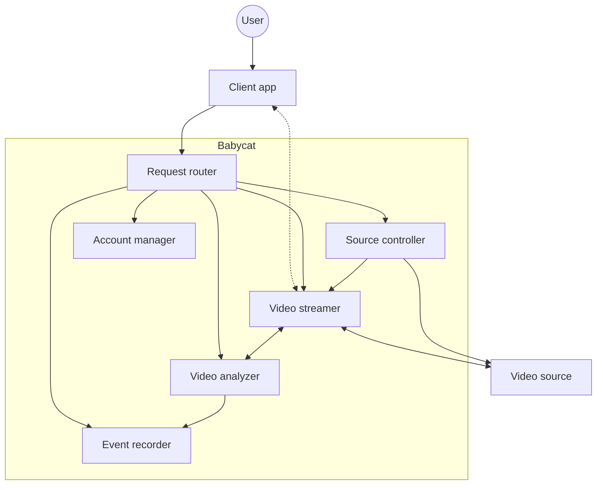

```mermaid
flowchart TB
    User(("User"))
    ClientApp["Client app"]
    VideoSource["Video source"]

    subgraph Babycat
        RequestRouter["Request router"]
        VideoStreamer["Video streamer"]
        SourceController["Source controller"]
        VideoAnalyzer["Video analyzer"]
        AccountManager["Account manager"]
        EventRecorder["Event recorder"]
    end

    User --> ClientApp
    ClientApp --> RequestRouter
    ClientApp <-.-> VideoStreamer

    RequestRouter --> VideoStreamer
    RequestRouter --> SourceController
    RequestRouter --> VideoAnalyzer
    RequestRouter --> EventRecorder
    RequestRouter --> AccountManager

    VideoStreamer <--> VideoSource
    VideoStreamer <--> VideoAnalyzer

    SourceController --> VideoSource
    SourceController --> VideoStreamer

    VideoAnalyzer --> EventRecorder
```
