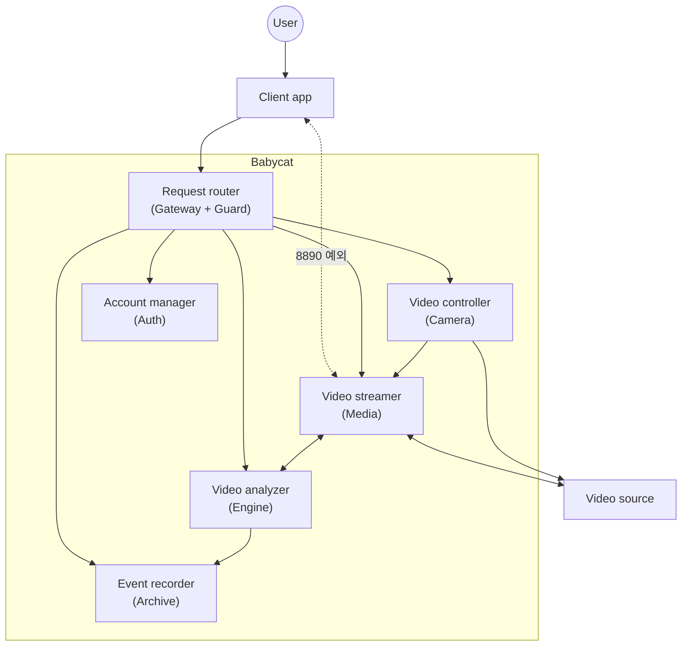

```mermaid
flowchart TB
    User(("User"))
    ClientApp["Client app"]
    VideoSource["Video source"]

    subgraph Babycat
        Gateway["Request router<br/>(Gateway + Guard)"]
        Media["Video streamer<br/>(Media)"]
        Camera["Video controller<br/>(Camera)"]
        Engine["Video analyzer<br/>(Engine)"]
        Auth["Account manager<br/>(Auth)"]
        Archive["Event recorder<br/>(Archive)"]
    end

    User --> ClientApp
    ClientApp --> Gateway
    ClientApp <-. "8890 예외" .-> Media

    Gateway --> Media
    Gateway --> Camera
    Gateway --> Engine
    Gateway --> Archive
    Gateway --> Auth

    Media <--> VideoSource
    Media <--> Engine

    Camera --> VideoSource
    Camera --> Media

    Engine --> Archive
```