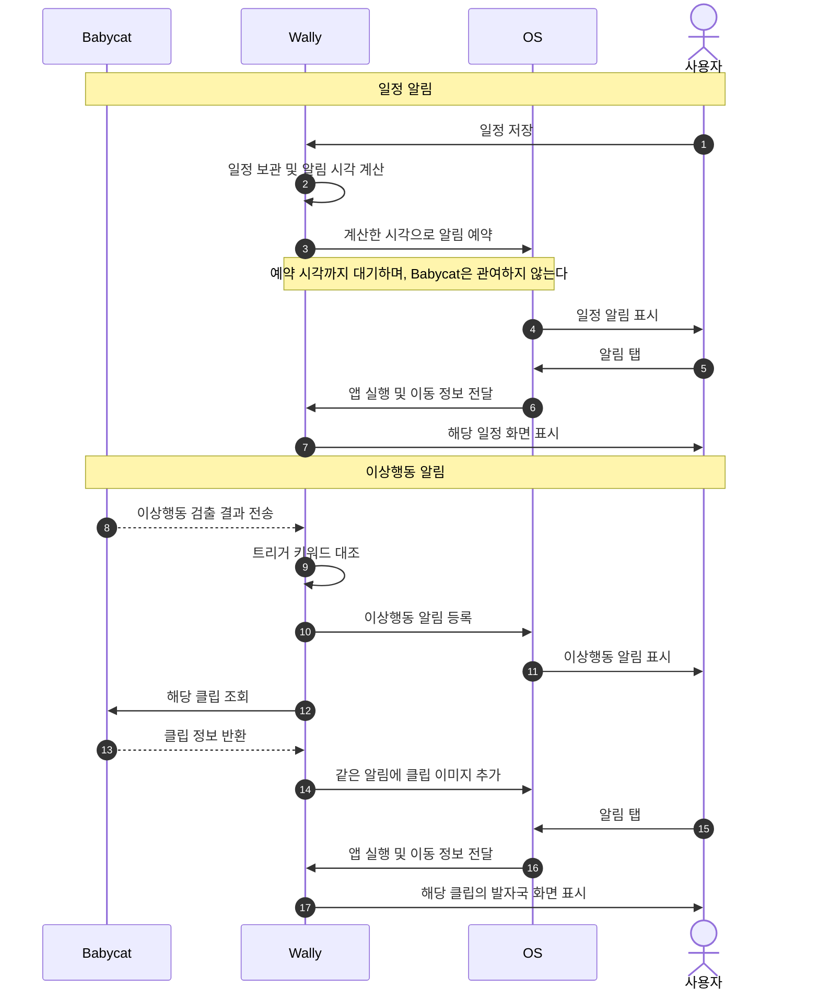

# 알림 시스템 시퀀스 다이어그램

일정 알림과 이상행동 알림을 한 장에 담았다. 두 흐름은 시작 주체가 다르다. 일정 알림은 사용자가 일정을 저장할 때 단말 안에서 예약되고, 이상행동 알림은 서버가 검출 결과를 보낼 때 시작된다.

```mermaid
sequenceDiagram
    autonumber
    participant Server as Babycat
    participant App as Wally
    participant OS as OS
    actor User as 사용자

    Note over Server,User: 일정 알림
    User->>App: 일정 저장
    App->>App: 일정 보관 및 알림 시각 계산
    App->>OS: 계산한 시각으로 알림 예약
    Note over App,OS: 예약 시각까지 대기하며, Babycat은 관여하지 않는다
    OS->>User: 일정 알림 표시
    User->>OS: 알림 탭
    OS->>App: 앱 실행 및 이동 정보 전달
    App->>User: 해당 일정 화면 표시

    Note over Server,User: 이상행동 알림
    Server-->>App: 이상행동 검출 결과 전송
    App->>App: 트리거 키워드 대조
    App->>OS: 이상행동 알림 등록
    OS->>User: 이상행동 알림 표시
    App->>Server: 해당 클립 조회
    Server-->>App: 클립 정보 반환
    App->>OS: 같은 알림에 클립 이미지 추가
    User->>OS: 알림 탭
    OS->>App: 앱 실행 및 이동 정보 전달
    App->>User: 해당 클립의 발자국 화면 표시
```

알림 설정과 권한이 모두 허용된 상태를 전제한다. 서버와 앱 사이의 점선은 SSE 전송과 그 응답을 뜻한다.
